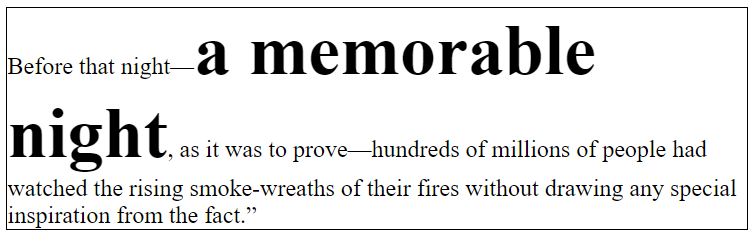

# Mise en page CSS : Flux d'affichage normal

> * Auteur : Gwénaël LAURENT
> * Date : 11/04/2021
> * OS : Windows 10 (version 20H2)
> * VScode : version 1.54.3 (system setup)
> * Node.js : version 12.16.2
> * Chrome : version 89.0.4389.114

- [Mise en page CSS : Flux d'affichage normal](#mise-en-page-css--flux-daffichage-normal)
- [1. Zone d'affichage d'une balise](#1-zone-daffichage-dune-balise)
  - [1.1 Les composants d'une boîte](#11-les-composants-dune-boîte)
  - [1.2 Le modèle standard de boîte CSS](#12-le-modèle-standard-de-boîte-css)
  - [1.3 Le modèle alternatif de boîte CSS](#13-le-modèle-alternatif-de-boîte-css)
  - [1.4 Visualiser les boîtes avec F12 dans le navigateur](#14-visualiser-les-boîtes-avec-f12-dans-le-navigateur)
- [2. Balises block ou inline](#2-balises-block-ou-inline)
- [3. Positionnement des boîtes en bloc](#3-positionnement-des-boîtes-en-bloc)
- [4. Positionnement des boîtes en ligne](#4-positionnement-des-boîtes-en-ligne)
- [5. Positionnements intérieurs et extérieurs](#5-positionnements-intérieurs-et-extérieurs)
- [6. Construire le HTML pour la mise en page](#6-construire-le-html-pour-la-mise-en-page)
  - [6.1 Balises blocs structurantes](#61-balises-blocs-structurantes)
    - [L'élément HTML ``<header>``](#lélément-html-header)
    - [L'élément HTML ```<footer>```](#lélément-html-footer)
    - [L'élément HTML ```<nav>```](#lélément-html-nav)
    - [L'élément HTML ```<article>```](#lélément-html-article)
    - [L'élément HTML ```<section>```](#lélément-html-section)
    - [L'élément HTML ```<aside>```](#lélément-html-aside)
  - [6.2 Balises génériques](#62-balises-génériques)
    - [L'élément HTML ```<div>```](#lélément-html-div)
    - [L'élément HTML ```<span>```](#lélément-html-span)

# 1. Zone d'affichage d'une balise
## 1.1 Les composants d'une boîte
Dans la terminologie CSS, **```la zone d'affichage d'une balise s'appelle une boîte```** (**box**). Les boîtes peuvent donc être de bloc (*block boxes*) ou en ligne (*inline boxes*) mais pas les deux à la fois.

Toutes les boîtes sont composées de la même façon :


* **```Le contenu```** : zone où sont affichés les éléments contenus par la boîte. Peut être dimensionnée en utilisant les propriétés CSS ```width``` et ```height```.
* **```La marge intérieure```** (ou remplissage) : zone vierge qui se présente comme un espacement encadrant le contenu ; sa taille peut être controllée sur chaque côté en utilisant la propriété CSS ```padding```
* **```Le cadre```** (ou bordure) : Le cadre englobe le contenu et le padding pour former une bordure. Sa taille et son style sont paramétrés par la propriété CSS ```border```
* **```La marge intérieure```** : zone vierge mais qui est cette fois située a l'extérieur de l'élément, séparant l'élément des autres éléments de la page. Sa taille peut être controllée sur chaque côté en utilisant la propriété ```margin```

## 1.2 Le modèle standard de boîte CSS
> Les navigateurs utilisent le modèle standard par défaut.

Les propriétés de largeur (```width```) et de hauteur (```height```) définissent la largeur et la hauteur du **```contenu de la boîte```**.

Exemple :
```css
.box {
    width: 350px;
    height: 150px;
    margin: 10px;
    padding: 25px;
    border: 5px solid black;
}
```


Hors marges extérieurs, l'espace occupé par notre boîte dans le modèle standard vaut alors 410px (350 + 25 + 25 + 5 + 5), et la hauteur, 210px (150 + 25 + 25 + 5 + 5).

## 1.3 Le modèle alternatif de boîte CSS
> Pour utiliser le modèle alternatif, il faut  définir la propriété ```box-sizing: border-box;``` sur la boîte.

Les propriétés de largeur (```width```) et de hauteur (```height```) définissent la largeur et la hauteur de **```la boîte totale```**, hors marges extérieures, en comprenant le contenu, le padding et le border. Cela revient à demander au navigateur de considérer la boîte du cadre (la "border box") comme la zone d'effet de width et height.

Exemple :
```css
.box {
    box-sizing: border-box;
    width: 350px;
    height: 150px;
    margin: 10px;
    padding: 25px;
    border: 5px solid black;
}
```


## 1.4 Visualiser les boîtes avec F12 dans le navigateur
Les outils de développement des navigateurs (F12) permettent de visualiser toutes les propriétés des différentes couches de la boîte (contenu, padding, border et margin). 

Dans le navigateur : F12 > clic droit sur un élément de la page > Inspecter


> Documentation : 
> * [Le modèle de Boîte](https://developer.mozilla.org/fr/docs/Learn/CSS/Building_blocks/The_box_model)


# 2. Balises block ou inline
Sans CSS, chaque balise HTML possède son propre type de placement dans le [flux d'affichage](https://developer.mozilla.org/fr/docs/Web/CSS/CSS_Flow_Layout) :
* Les **```élément en ligne```** (**inline** elements) sont affichés dans le sens dans lequel les mots sont écrits
* Les **```éléments de bloc```** (**block** elements) sont affichés les uns après les autres, à la façon des paragraphes


> Remarque : les directions sont inversées pour les langues qui ont un mode d'écriture vertical, comme le japonais.


# 3. Positionnement des boîtes en bloc
Si une boîte est définie en bloc, elle suivra alors les règles suivantes :

* La boîte s'étend en largeur pour remplir totalement l'espace offert par son conteneur. Dans la plupart des cas, la boîte devient alors aussi large que son conteneur, occupant 100% de l'espace disponible.
* La boîte occupe sa propre nouvelle ligne et créé un retour à la ligne, faisant ainsi passer les éléments suivants à la ligne d'après.
* Les propriétés de largeur (width) et de hauteur (height) sont toujours respectées.
* Les propriétés padding, margin et border — correspondantes respectivement aux écarts de remplissage interne, externe et à la bordure de la boîte — auront pour effet de repousser les autres éléments.

Les éléments tels que les titres (```<h1>```,```<h2>```, etc.) et les paragraphes (```<p>```) utilisent le mode "bloc" comme propriété de positionnement extérieur par défaut.

Les boîtes de bloc possèdent des marges qui permettent de créer une séparation entre les éléments.

> Pour visualiser l'emplacement des boîtes de bloc pendant la mise en page, on peut leur attribuer une couleur de fond temporaire

```html
<div>
    <p>Un</p>
    <p>Deux</p>
    <p>Trois</p>
</div>
```
```css
p {
    background-color: hotpink;
}
```


Si on définit explicitement des marges nulles sur les paragraphes, les bordures se toucheront.
```css
p {
    background-color: hotpink;
    margin: 0;
}
```


La spécification indique que les marges verticales entre chaque éléments de bloc fusionnent. Dans l'exemple suivant, les paragraphes ont une marge en haut qui mesure 20 pixels et une marge en bas qui mesure 40 pixels. La taille de la marge entre les deux paragraphes est donc de 40px car la plus petite est « fusionnée » avec la plus grande.

```css
p {
    background-color: hotpink;
    margin: 20px 0 40px 0;
}
```


Par défaut, les éléments de bloc « s'étalent » horizontalement autant qu'ils le peuvent au sein du bloc englobant. 

Même si on fixe leur largeur et qu'ils puissent tenir horizontalement à plusieurs sur la même ligne, **```les éléments de bloc se positionnent les uns au dessous des autres```**.
```css
p {
    background-color: hotpink;
    width: 30%;
}
```


# 4. Positionnement des boîtes en ligne
Si une boîte est positionnée en ligne, alors :
* La boîte ne crée pas de retour à la ligne, les autres éléments se suivent donc en ligne.
* Les propriétés de largeur (width) et de hauteur (height) ne s'appliquent pas.
* Le padding, les marges et les bordures verticales (en haut et en bas) seront appliquées mais ne provoqueront pas de déplacement des éléments alentours.
* Le padding, les marges et les bordures horizontales (à gauche et à droite) seront appliquées et provoqueront le déplacement des éléments alentours.

Les éléments ```<a>```, utilisés pour les liens, ou encore ```<span>```, ```<em>``` et ```<strong>``` sont tous des éléments qui s'affichent "en ligne" par défaut.


**Exemple 1** : observez que les paramètres width et height sont totalement ignorés. Les propriétés de margin, padding et border sont quant à elles appliquées, mais n'ont pas modifié l'espacement avec les autres éléments de la page, se superposant ainsi avec les mots environnants dans le paragraphe.


```css
span {
    margin: 20px;
    padding: 20px;
    width: 80px;
    height: 50px;
    background-color: lightblue;
    border: 2px solid blue;
}
```
```html
<p>I am a paragraph and this is a <span>span</span> inside that paragraph. A span is
    an inline element and so does not respect width and height.</p>
```

**Exemple 2** : Dans l'exemple suivant on a trois boîtes en ligne créées :
* entre les balises ```<p>``` et ```<strong>```
* entre les balises ```<strong>``` et ```</strong>```
* entre les balises ```</strong>``` et ```</p>```



```css
strong {
    font-size: 300%;
}
```
```html
<p>Before that night—<strong>a memorable night</strong>, as it was to prove—hundreds
    of millions of people had watched the rising smoke-wreaths of their fires without
    drawing any special inspiration from the fact.”</p>
```
La hauteur de la boîte de ligne est définie avec la taille de la plus grand boîte qu'elle contient. Dans cet exemple, c'est le contenu de l'élément ```<strong>``` qui détermine la hauteur de la boîte de ligne pour cette ligne


> Documentation : 
> * [Disposition de bloc et en ligne avec le flux normal](https://developer.mozilla.org/fr/docs/Web/CSS/CSS_Flow_Layout/Block_and_Inline_Layout_in_Normal_Flow)

# 5. Positionnements intérieurs et extérieurs
Les boîtes en CSS possèdent un type de **```positionnement extérieur```** (*outer display*) qui détermine si la boîte est "en ligne" ou bien "en bloc".

Cependant, les boîtes ont aussi un type de **```positionnement intérieur```** (*inner dipslay*) , qui décrit le comportement de mise en page des élements contenus dans la boîte. Par défaut, les éléments contenus dans la boîte sont affichés dans la disposition normale, ce qui signifie qu'ils se comportent exactement comme n'importe quel autre élément "en bloc" ou "en ligne" (comme décrit auparavant).

Ce type de positionnement intérieur peut naturellement être modifié.

Ainsi, si on donne la propriété ```display: flex;``` ou ```display: grid;``` à un élément, son type de positionnement extérieur est "en bloc" (block), mais son type de positionnement intérieur est modifié en flex ou en grid. Tout élément directement enfant de cette boîte se voit alors changé en élément flex ou grid, et sera mis en page selon les règles précisées dans les spécifications correspondantes.

# 6. Construire le HTML pour la mise en page
## 6.1 Balises blocs structurantes
Depuis la version 5 de HTML, de nouvelles balises permettent de structurer la page web, d'organiser le contenenu d'une page en donnant du sens aux différentes parties de la page. 

Certaines de ces balises sont des boîtes de bloc et peuvent servir naturellement à la mise en page CSS.

### L'élément HTML ``<header>`` 
représente un groupe de contenu introductif ou de contenu aidant à la navigation. Il peut contenir des éléments de titre, mais aussi d'autres éléments tels qu'un logo, un formulaire de recherche, etc.

```html
<header>
    <h1>Cute Puppies Express!</h1>
</header>
```

### L'élément HTML ```<footer>``` 
représente le pied de page. Il contient habituellement des informations sur l'auteur, les données relatives au droit d'auteur (copyright) ou les liens vers d'autres documents en relation.

```html
<footer>
    <p>© 2018 Gandalf</p>
</footer>
```

### L'élément HTML ```<nav>``` 
représente une section d'une page ayant des liens vers d'autres pages ou des fragments de cette page. Autrement dit, c'est une section destinée à la navigation dans un document (avec des menus, des tables des matières, des index, etc.).

```html
<nav class="crumbs">
    <ul>
        <li class="crumb"><a href="#">Bikes</a></li>
        <li class="crumb"><a href="#">BMX</a></li>
        <li class="crumb">Jump Bike 3000</li>
    </ul>
</nav>
```

### L'élément HTML ```<article>``` 
représente du contenu autonome dans un document. Ceci peut être un message sur un forum, un article de journal ou de magazine, une parution sur un blog, un commentaire d'utilisateur, un widget ou gadget interactif, ou tout autre élément de contenu indépendant. Ce contenu est prévu pour être distribué ou réutilisé indépendamment (par exemple dans un flux de syndication)

```html
<article>
    <h1>Titre de l'article</h1>
    <p>Contenu de l'article</p>
</article>
```

### L'élément HTML ```<section>``` 
représente une section générique d'un document, par exemple un groupe de contenu thématique. Une section commence généralement avec un titre.

> L'élément ```<section>``` ne doit pas être utilisé lorsque le sectionnement du contenu sert uniquement la mise en forme, c'est le rôle de la balise générique ```<div>```. Pour savoir quelle balise utiliser, on peut se demander si la section doit apparaître sur le plan du document : si oui, on utilisera ```<section>```, sinon, ```<div>```

```html
<section>
    <h1>Articles</h1>
    <article>
        <h2>Article 1</h2>
        <p>Texte de l'article</p>
    </article>
</section>
```

### L'élément HTML ```<aside>``` 
(en anglais, "aparté") représente une partie d'un document dont le contenu n'a qu'un rapport indirect avec le contenu principal du document. Les apartés sont fréquemment présents sous la forme d'encadrés ou de boîtes de légende. Par exemple, on pourra s'en servir pour proposer la définition d'un terme, une biographie de l'auteur de l'article, un glossaire, préciser des sources, une liste d'articles en relation...

```html
<aside>
    <h4>Sources de l'article</h4>
    <ul>
        <li><a href="#">Lien 1</a></li>
        <li><a href="#">Lien 2</a></li>
        <li><a href="#">Lien 3</a></li>
    </ul>
</aside> 
```

> Documentation : [Structures et sections d'un document HTML5](https://developer.mozilla.org/fr/docs/Web/Guide/HTML/Using_HTML_sections_and_outlines)

## 6.2 Balises génériques
Les balises ```<div>``` et ```<span>``` sont des conteneurs "génériques", c'est à dire qu'elles ne donnent pas de sens particulier au contenu de la page web.

### L'élément HTML ```<div>```
est un **```conteneur générique de bloc```** (*block*) qui permet d'organiser le contenu sans représenter rien de particulier.  Il peut être utilisé afin de grouper d'autres éléments pour leur appliquer un style (en utilisant les attributs class ou id).

> L'élément ```<div>``` doit uniquement être utilisé lorsqu'il n'existe aucun autre élément dont la sémantique permet de représenter le contenu (par exemple ```<article>``` ou ```<nav>```).

Exemple :
```html
<div class="warning">
    <p>Beware of the leopard</p>
</div>
```

### L'élément HTML ```<span>```
est un **```conteneur générique en ligne```** (*inline*) pour les contenus phrasés. Il ne représente rien de particulier. Il peut être utilisé pour grouper des éléments afin de les mettre en forme (grâce aux attributs class ou id et aux règles CSS).

> L'élément ```<span>```  doit uniquement être utilisé lorsqu'aucun autre élément sémantique n'est approprié (par exemple ```<em>``` ou ```<strong>```)

Exemple :
```html
<p>Add the <span class="ingredient">basil</span>, <span class="ingredient">pine nuts</span> 
and <span class="ingredient">garlic</span> to a blender and blend into a paste.</p>
```
