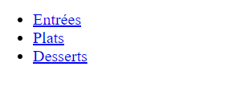
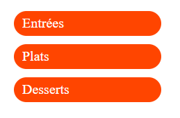
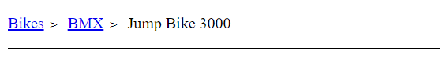
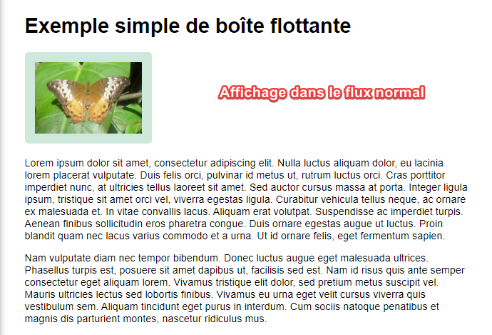
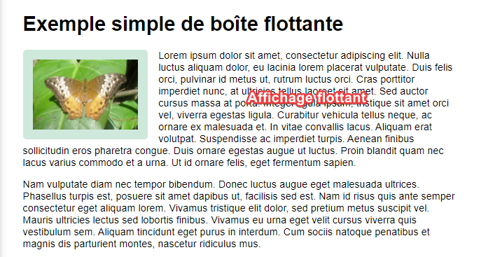
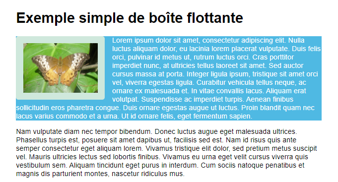
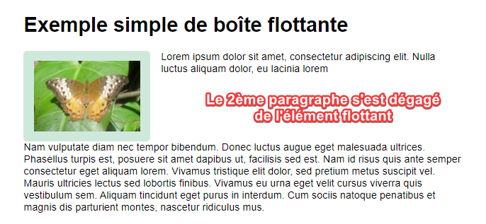
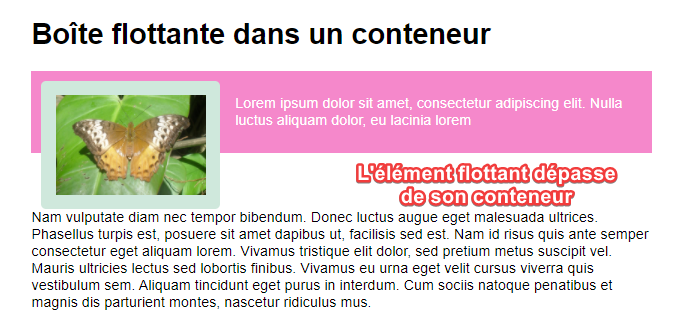
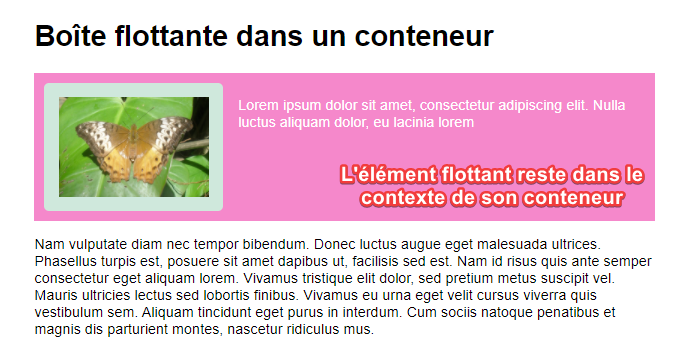

# Positionnement CSS avec ```inline-block``` et ```float```

> * Auteur : Gwénaël LAURENT
> * Date : 12/04/2021
> * OS : Windows 10 (version 20H2)
> * VScode : version 1.54.3 (system setup)
> * Node.js : version 12.16.2
> * Chrome : version 89.0.4389.114

- [Positionnement CSS avec ```inline-block``` et ```float```](#positionnement-css-avec-inline-block-et-float)
- [1. Modification du type de placement dans le flux d'affichage](#1-modification-du-type-de-placement-dans-le-flux-daffichage)
  - [1.1 Propriété display](#11-propriété-display)
  - [1.2 Exemple - Convertir un lien en élément de bloc](#12-exemple---convertir-un-lien-en-élément-de-bloc)
  - [1.3 Exemple - Convertir un list item en élément inline-bloc](#13-exemple---convertir-un-list-item-en-élément-inline-bloc)
- [2. Les boîtes flottantes](#2-les-boîtes-flottantes)
  - [2.1 Utilité](#21-utilité)
  - [2.2 Utilisation pour faire flotter une image](#22-utilisation-pour-faire-flotter-une-image)
  - [2.3 Dégagement des boîtes flottantes](#23-dégagement-des-boîtes-flottantes)
  - [2.4 Dégagement des boîtes flottantes : cas d'une boîte enveloppante](#24-dégagement-des-boîtes-flottantes--cas-dune-boîte-enveloppante)

# 1. Modification du type de placement dans le flux d'affichage
## 1.1 Propriété display
Chaque balise HTML possède son propre type de placement dans le flux d'affichage : **```élément en ligne```** ou **```éléments de bloc```**.

La propriété CSS **```display```** permet de modifier l'affichage par défaut des éléments. Chaque chose dans le cours normal a une valeur de propriété display. Les éléments se règlent sur cette valeur pour définir leur comportement par défaut. .

> Ici, nous n'utiliserons que les valeurs de display qui modifient le **```positionnement extérieur```** des balises dans le flux (*outer display*) .

Les valeurs standards de la propriété ```display``` sont :
* **```display: inline;```** : éléments en ligne, affichés dans le sens dans lequel les mots sont écrits. Ex : ```<a>```, ```<em>```, ```<span>```, ...
* **```display: block;```** : éléments de bloc, affichés les uns après les autres. Ex : ```<p>```, ```<div>```, ```<section>```, ...
* **```display: inline-block;```** : éléments positionnés les uns à côté des autres (comme les inlines) mais qui peuvent être redimensionnés (comme les blocs). Ex : ```<select>```, ```<input>```
* **```display: none;```** : Eléments non affichés. Ex : ```<head>```

## 1.2 Exemple - Convertir un lien en élément de bloc
Les liens HTML ```<a>``` sont par défaut des éléments en ligne. On ne peut donc pas modifier leurs paramètres ```width``` et ```height```, les marges verticales ne déplacent pas les éléments alentours.

Grâce à la propriété display, on peut modifier leur boîte CSS pour que les liens ```<a>``` se comporte comme des boîtes en bloc ```display: block;```. On peut alors fixer leur apparence.

Exemple pour les liens d'un menu de navigation :
```html
<nav class="menu2">
    <ul>
        <li><a href="#">Entrées</a></li>
        <li><a href="#">Plats</a></li>
        <li><a href="#">Desserts</a></li>
    </ul>
</nav>
```
Affichage dans le flux standard :



Modification des liens en boîtes de bloc :
```css
.menu2 ul {
    list-style-type: none;
}

.menu2 ul li a {
    display: block;
    width: 150px;
    text-decoration: none;
    background-color: orangered;
    border-radius: 20px;
    margin: 10px;
    padding: 5px 10px 5px 10px;
    color: white;
}
```
Affichage grâce au comportement bloc :



> Le fait que vous puissiez changer la valeur d'affichage de n'importe quel élément signifie que vous pouvez choisir des éléments HTML pour leur signification sémantique, sans vous soucier de leur apparence. Leur apparence est quelque chose que vous pouvez modifier

## 1.3 Exemple - Convertir un list item en élément inline-bloc
Autre exemple de menu mais avec les éléments de liste ```<li>``` verticaux. pour créer une navigation de type "fil d'Ariane".

> La navigation avec un fil d'Ariane (breadcrumb) permet à un utilisateur de comprendre l'emplacement auquel il se trouve au sein du site web en fournissant un fil d'Ariane qui permette de revenir à la page de départ.

Par défaut, le placement des balises ```<li>``` est en ```display: list-item;```, ce qui ressemble beaucoup à une boîte en bloc. Pour disposer les éléments de liste sur la même ligne il faut utiliser ```display: inline-block;```



```html
<nav class="ariane">
    <ul>
        <li><a href="#">Bikes</a></li>
        <li><a href="#">BMX</a></li>
        <li>Jump Bike 3000</li>
    </ul>
</nav>
```
```css
nav {
    border-bottom: 1px solid black;
}

.ariane ul {
    list-style-type: none;
    padding-left: 0
}

.ariane li {
    display: inline-block;
}

.ariane li a::after {
    display: inline-block;
    color: black;
    content: '>';
    font-size: 80%;
    font-weight: bold;
    padding: 0 0.5em;
}
```


# 2. Les boîtes flottantes
## 2.1 Utilité
La propriété float a été introduite pour permettre aux développeurs web d'implémenter des dispositions simples comme une image flottant dans une colonne de texte, le texte se développant autour de cette image sur la gauche ou sur la droite. 

> **L'utilisation des boîtes flottantes pour créer des mises en page complètes avec plusieurs colonnes doit être considérée comme une technique du passé**

## 2.2 Utilisation pour faire flotter une image
Commençons par l'affichage de l'image dans le flux normal.

Code HTML :
```html
<h1>Exemple simple de boîte flottante</h1>


<p> Lorem ipsum dolor sit amet, consectetur adipiscing elit. Nulla luctus aliquam dolor, eu lacinia lorem
    placerat vulputate. Duis felis orci, pulvinar id metus ut, rutrum luctus orci. Cras porttitor imperdiet
    nunc, at ultricies tellus laoreet sit amet. Sed auctor cursus massa at porta. Integer ligula ipsum,
    tristique sit amet orci vel, viverra egestas ligula. Curabitur vehicula tellus neque, ac ornare ex malesuada
    et. In vitae convallis lacus. Aliquam erat volutpat. Suspendisse ac imperdiet turpis. Aenean finibus
    sollicitudin eros pharetra congue. Duis ornare egestas augue ut luctus. Proin blandit quam nec lacus varius
    commodo et a urna. Ut id ornare felis, eget fermentum sapien.</p>

<p>Nam vulputate diam nec tempor bibendum. Donec luctus augue eget malesuada ultrices. Phasellus turpis est,
    posuere sit amet dapibus ut, facilisis sed est. Nam id risus quis ante semper consectetur eget aliquam
    lorem. Vivamus tristique elit dolor, sed pretium metus suscipit vel. Mauris ultricies lectus sed lobortis
    finibus. Vivamus eu urna eget velit cursus viverra quis vestibulum sem. Aliquam tincidunt eget purus in
    interdum. Cum sociis natoque penatibus et magnis dis parturient montes, nascetur ridiculus mus.</p>

```
Feuille de style :
```css
body {
    width: 90%;
    max-width: 900px;
    margin: 0 auto;
    font: .9em/1.2 Arial, Helvetica, sans-serif
}

.box {
    width: 150px;
    height: 100px;
    border-radius: 5px;
    background-color: rgb(207,232,220);
    padding: 1em;
    float: left;
    margin-right: 15px;
}
```
Evidemment, le flux normal d'affichage place la boîte d'image au-dessus du texte.



Pour faire flotter l'image dans le texte ajoutez ces deux propriétés à la règle pour ```.box ```

```css
    float: left;
    margin-right: 15px;
```



Tout contenu disposé après l'élément flottant dans le cours normal de la mise en page (c'est à dire disposé à la suite dans le code source) va maintenant l'envelopper en remplissant l'espace sur sa droite sur toute sa hauteur.

**ATTENTION** : L'image a été sorti du flux normal d'affichage, le texte du paragraphe l'entoure, MAIS ```la boîte du contenu du paragraphe reste sur toute la largeur du conteneur```, y compris derrière l'image.



Faire flotter le contenu sur la droite a exactement le même effet, mais inversé.
```css
    float: right;
    margin-left: 15px;
```

## 2.3 Dégagement des boîtes flottantes
L'image est retirée du cours normal de l'affichage et les autres éléments se placent à côté, donc si nous voulons empêcher un élément à la suite de remonter pour se placer à côté, nous devons le dégager. Cette opération se réalise à l'aide de la propriété **```clear```**.

Modifiez le code HTML de l'exemple précedent :
* diminuez le nombre de mots du premier paragraphe
* ajoutez une classe ```stop-float``` au second paragraphe sous l'image

Ajoutez au CSS :
```css
.stop-float {
    clear: left;
}
```



La propriété  clear accepte les valeurs suivantes :
* **```left ```**: dégage les élément à droite de la boîte flottante.
* **```right ```**: dégage les éléments à gauche.
* **```both ```**: dégage de tous élément flottant, à gauche et à droite.

## 2.4 Dégagement des boîtes flottantes : cas d'une boîte enveloppante
La propriété clear n'est pas toujours suffisante, notamment si :
* la boîte flottante est de grande hauteur 
* la boîte flottante est enveloppée dans une autre boîte

**Exemple de mise en évidence du problème** : Modifiez votre document de sorte que le premier paragraphe et la boîte flottante soient englobés dans un élément ```<div>``` de classe wrapper.
```html
<div class="wrapper">
    

    <p> Lorem ipsum dolor sit amet, consectetur adipiscing elit.
        Nulla luctus aliquam dolor, eu lacinia lorem</p>
</div>
```
Modifier le CSS pour mettre en évience le positionnement de la div :
```css
.wrapper {
    background-color: rgb(245, 136, 203);
    padding: 10px;
    color: #fff;
}
```



Le problème ici, c'est qu'on aimerait que l'image flottante ne dépasse pas de son conteneur ```<div class="wrapper">```.

Pour faire ça, il existe plusieurs méthodes.
1. ajoutez ```overflow: auto;``` aux règles de la classe .wrapper
2. ajoutez ```display: flow-root;``` aux règles de la classe .wrapper



Les deux méthodes fonctionnent en créant ce que l'on appelle un **```block formatting context```** (BFC) (contexte de formatage de bloc). C'est comme une mini composition à l'intérieur de la page, composition dans laquelle tout est contenu ; l'élément flottant est contenu à l'intérieur de la BFC et l'arrière-plan est derrière les deux éléments.

**Remarque sur l'utilisation de ```overflow: auto;```** : dans certains cas, vous pourriez avoir des barres de défilement indésirables ou des ombres découpées en raison des conséquences involontaires de l'utilisation du débordement.

**L'utilisation de ```display: flow-root;```** est la solution moderne au problème, elle ne présente pas de conséquences imprévisibles à son utilisation. Il faut cependant vérifier sa compatibilité avec les navigateurs cibles ([caniuse.com/flow-root](https://caniuse.com/flow-root))


> Documentation : 
> * [Les boîtes flottantes](https://developer.mozilla.org/fr/docs/Learn/CSS/CSS_layout/Floats)