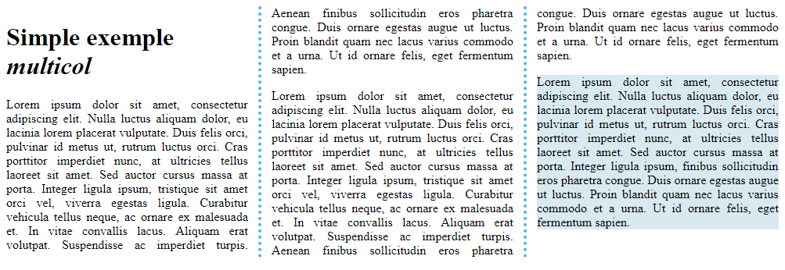
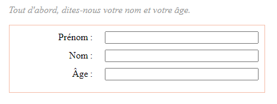

# Positionnement CSS avec ```position```, ```z-index```, ```columns``` et ```table```

> * Auteur : Gwénaël LAURENT
> * Date : 21/04/2021
> * OS : Windows 10 (version 20H2)
> * Chrome : version 90.0.4430.72

- [Positionnement CSS avec ```position```, ```z-index```, ```columns``` et ```table```](#positionnement-css-avec-position-z-index-columns-et-table)
- [1. Introduction à la propriété ```position```](#1-introduction-à-la-propriété-position)
  - [1.2 Positionnement ```static```](#12-positionnement-static)
  - [1.3 Positionnement ```relative```](#13-positionnement-relative)
  - [1.4 Positionnement ```absolute```](#14-positionnement-absolute)
  - [1.5 Positionnement ```fixed```](#15-positionnement-fixed)
  - [1.6 Positionnement ```sticky```](#16-positionnement-sticky)
- [2. Présentation du ```z-index```](#2-présentation-du-z-index)
- [3. Contenu sur plusieurs colonnes ```columns```](#3-contenu-sur-plusieurs-colonnes-columns)
- [4. Les tableaux CSS ```display: table```](#4-les-tableaux-css-display-table)
- [5. Documentation :](#5-documentation-)

# 1. Introduction à la propriété ```position```
Le positionnement CSS permet de sortir les éléments du cours normal de composition du document, et faire qu'ils se comportent différemment. Il y a différents types de positionnement que vous pouvez appliquer à des éléments HTML. Pour utiliser un type particulier de positionnement sur un élément, nous utilisons la propriété CSS **```position```**.

Les propriétés ```top```, ```bottom```, ```left``` et ```right``` sont utilisés conjointement à position pour définir exactement là où placer l'élément HTML.

> les valeurs de ces propriétés peuvent prendre n'importe quelle unité logiquement attendue — pixels, mm, rem, %, etc.


## 1.2 Positionnement ```static```
Le positionnement statique est le comportement par défaut (en suivant le flux standard)

```css
position: static;
```

## 1.3 Positionnement ```relative```
Le positionnement relatif permet de "décaler" l'élément sélectionné **```par rapport à son emplacement standard```** dans le flux.

```css
.decal-rel {
    position: relative;
    top: 10px;
    left: 20px;
}
```

## 1.4 Positionnement ```absolute```
Un élément positionné de manière absolue ne fait plus partie du cours normal de la mise en page. 

Les propriétés ```top```, ```bottom```, ```left``` et ```right``` définissent la distance à laquelle l'élément doit se situer **```par rapport aux côtés de son élément conteneur```**. 

Le conteneur est :
* soit l'élément ```<html>```
* soit l'élément parent qui possède la propriété ```position: relative;```

```css
.decal-abs {
    position: absolute;
    top: 10px;
    left: 20px;
}
```

## 1.5 Positionnement ```fixed```
tout à fait semblable positionnement absolu, à l'exception que l'élément est fixé **```par rapport à la vue du navigateur```** et non d'un autre élément. C'est très pratique pour créer des effets tels qu'un menu de navigation persistant, toujours au même endroit sur l'écran, quand l'utilisateur fait défiler le reste de la page.

```css
position: fixed;
```

## 1.6 Positionnement ```sticky```
Il s'agit essentiellement d'un hybride entre position relative et position fixe : l'élément à positionner est en **```positionnement relatif jusqu'à un certain seuil```** (par ex. 10px du haut de la fenêtre), seuil au delà duquel il est en **```positionnement fixe```**. Ce positionnement s'utilise par exemple pour faire défiler une barre de navigation avec la page jusqu'à un certain point et ensuite coller en haut de la page.

```css
.positioned {
    position: sticky;
    top: 30px;
    left: 30px;
}
```

# 2. Présentation du ```z-index```
En modifiant la position des éléments ils se chevauchent naturellement. La propriété ```z-index``` permet de gérer **```l'ordre d'empilement```**.

```css
z-index: 1;
```

L'axe z est une ligne imaginaire qui va de la surface de votre écran, vers votre visage. Les valeurs de z-index affectent l'emplacement des éléments positionnés sur cet axe ; les valeurs positives les déplacent vers le haut de la pile, et les valeurs négatives les déplacent vers le bas de la pile. Par défaut, les éléments positionnés ont tous un z-index  auto, qui est effectivement 0.


# 3. Contenu sur plusieurs colonnes ```columns```
La disposition multi-colonnes ("multicol") étend le mode de disposition en bloc et permet de définir simplement plusieurs colonnes de texte. Pour utiliser efficacement l'espace fourni par un grand écran, on préfèrera utiliser des colonnes de largeur fixe, disposée côte à côte, à la façon d'un journal.

Le "multicol" est un **```positionnement flexible```**. Le nombre de colonnes peut s'adapter à la place disponible.

Propriété CSS utilisées :
* [column-count](https://developer.mozilla.org/fr/docs/Web/CSS/column-count) : nombre de colonnes maximum
* [column-width](https://developer.mozilla.org/fr/docs/Web/CSS/column-width) : largeur minimum des colonnes. Le navigateur dispose le maximum de colonnes possible de la taille fixée ; le reste de l'espace est partagé entre les colonnes existantes. Si la largeur du conteneur est inférieure à column-width, le contenu est affiché sur une seule colonne. 
* [columns](https://developer.mozilla.org/fr/docs/Web/CSS/columns) : propriété raccourcie permettant de définir les deux propriétés column-width et column-count
* [column-gap](https://developer.mozilla.org/fr/docs/Web/CSS/column-gap) : espace entre chaque colonne
* [column-rule](https://developer.mozilla.org/fr/docs/Web/CSS/column-rule) : affiche une ligne entre les colonnes (appelée "règle")
* [break-inside](https://developer.mozilla.org/fr/docs/Web/CSS/break-inside) : pour contrôler les coupures de contenu

Exemple simple de multi-colonnes :



```html
<div class="container">
    <h1>Simple exemple <i>multicol</i></h1>

    <p> Lorem ipsum dolor sit amet, consectetur adipiscing elit. Nulla luctus aliquam dolor, eu lacinia lorem
        placerat vulputate. Duis felis orci, pulvinar id metus ut, rutrum luctus orci. Cras porttitor imperdiet
        nunc, at ultricies tellus laoreet sit amet. Sed auctor cursus massa at porta. Integer ligula ipsum,
        tristique sit amet orci vel, viverra egestas ligula. Curabitur vehicula tellus neque, ac ornare ex
        malesuada et. In vitae convallis lacus. Aliquam erat volutpat. Suspendisse ac imperdiet turpis. Aenean
        finibus sollicitudin eros pharetra congue. Duis ornare egestas augue ut luctus. Proin blandit
        quam nec lacus varius commodo et a urna. Ut id ornare felis, eget fermentum sapien.</p>

    <p> Lorem ipsum dolor sit amet, consectetur adipiscing elit. Nulla luctus aliquam dolor, eu lacinia lorem
        placerat vulputate. Duis felis orci, pulvinar id metus ut, rutrum luctus orci. Cras porttitor imperdiet
        nunc, at ultricies tellus laoreet sit amet. Sed auctor cursus massa at porta. Integer ligula ipsum,
        tristique sit amet orci vel, viverra egestas ligula. Curabitur vehicula tellus neque, ac ornare ex
        malesuada et. In vitae convallis lacus. Aliquam erat volutpat. Suspendisse ac imperdiet turpis. Aenean
        finibus sollicitudin eros pharetra congue. Duis ornare egestas augue ut luctus. Proin blandit
        quam nec lacus varius commodo et a urna. Ut id ornare felis, eget fermentum sapien.</p>

    <p> Lorem ipsum dolor sit amet, consectetur adipiscing elit. Nulla luctus aliquam dolor, eu lacinia lorem
        placerat vulputate. Duis felis orci, pulvinar id metus ut, rutrum luctus orci. Cras porttitor imperdiet
        nunc, at ultricies tellus laoreet sit amet. Sed auctor cursus massa at porta. Integer ligula ipsum,
        finibus sollicitudin eros pharetra congue. Duis ornare egestas augue ut luctus. Proin blandit
        quam nec lacus varius commodo et a urna. Ut id ornare felis, eget fermentum sapien.</p>
</div>
```

```css
.container {
    column-count: 3;
    column-width: 300px;
    column-gap: 30px;
    column-rule: 4px dotted rgb(79, 185, 227);
}

.container>p {
    text-align: justify;
}

.container>p:last-child {
    background-color: rgb(217, 233, 240);
    break-inside: avoid;
    page-break-inside: avoid;  /*compatibilité anciens navigateurs*/
}
```

Documentation : [MDN Disposition sur plusieurs colonnes](https://developer.mozilla.org/fr/docs/Learn/CSS/CSS_layout/Multiple-column_Layout)


# 4. Les tableaux CSS ```display: table```
La valeur de la propriété CSS ```display : table;``` modifie l'affichage du contenu de l'élément HTML. L'élément se comporte alors comme un élément HTML ```<table>```. Il définit une boîte de bloc.

Exemple pour mettre en page un formulaire utilisateur :



```html
<form>
    <p>Tout d'abord, dites‑nous votre nom et votre âge.</p>
    <div>
        <label for="fname">Prénom :</label>
        <input type="text" id="fname">
    </div>
    <div>
        <label for="lname">Nom :</label>
        <input type="text" id="lname">
    </div>
    <div>
        <label for="age">Âge :</label>
        <input type="text" id="age">
    </div>
</form>
```

```css
form {
    display: table;
    margin: 0 auto;
    width: 400px;
    border: 1px solid rgb(245, 188, 167);
    padding: 10px;
}

form div {
    display: table-row;
}

form label,
form input {
    display: table-cell;
    margin-bottom: 10px;
}

form label {
    width: 200px;
    padding-right: 20px;
    text-align: right;
}

form input {
    width: 250px;
}

form p {
    display: table-caption;
    caption-side: top;
    width: 430px;
    color: #999;
    font-style: italic;
}
```

Documentation : [MDN Les tableaux CSS](https://developer.mozilla.org/fr/docs/Learn/CSS/CSS_layout/Introduction#les_tableaux_css)


# 5. Documentation : 
> * [Le positionnement](https://developer.mozilla.org/fr/docs/Learn/CSS/CSS_layout/Positioning)
> * [Techniques de positionnement](https://developer.mozilla.org/fr/docs/Learn/CSS/CSS_layout/Introduction#techniques_de_positionnement)
> * [Disposition sur plusieurs colonnes](https://developer.mozilla.org/fr/docs/Learn/CSS/CSS_layout/Multiple-column_Layout)