# Mise en page CSS : ```Grid Layout```

> * Auteur : Gwénaël LAURENT
> * Date : 20/04/2021
> * OS : Windows 10 (version 20H2)
> * Chrome : version 90.0.4430.72

- [Mise en page CSS : ```Grid Layout```](#mise-en-page-css--grid-layout)
- [1. Pas un nouveau framework !](#1-pas-un-nouveau-framework-)
- [2. Exemples d'utilisation](#2-exemples-dutilisation)
  - [Mise en page globale](#mise-en-page-globale)
  - [Mise en page avec une grille de 12 colonnes](#mise-en-page-avec-une-grille-de-12-colonnes)
  - [Mise en page d'une liste d'articles](#mise-en-page-dune-liste-darticles)
  - [Mise en page à plusieurs niveaux](#mise-en-page-à-plusieurs-niveaux)
  - [Mise en page d'un header](#mise-en-page-dun-header)
  - [Mise en page d'un formulaire](#mise-en-page-dun-formulaire)
- [3. Grilles et accessibilité](#3-grilles-et-accessibilité)
- [4. Terminologie](#4-terminologie)
- [5. Création d'une grille CSS](#5-création-dune-grille-css)
  - [5.1 Création de la grille](#51-création-de-la-grille)
  - [5.2 Grilles flexibles avec l'unité "fr"](#52-grilles-flexibles-avec-lunité-fr)
  - [5.3 Espaces entre pistes : les gouttières](#53-espaces-entre-pistes--les-gouttières)
  - [5.4 Utiliser la notation repeat() pour définir les pistes](#54-utiliser-la-notation-repeat-pour-définir-les-pistes)
  - [5.5 Grille implicite et grille explicite](#55-grille-implicite-et-grille-explicite)
  - [5.6 Dimensionner une piste avec minmax](#56-dimensionner-une-piste-avec-minmax)
  - [5.7 Autant de colonnes que possibles](#57-autant-de-colonnes-que-possibles)
- [6. Positionner les éléments sur les lignes](#6-positionner-les-éléments-sur-les-lignes)
  - [6.1 Les lignes de grilles](#61-les-lignes-de-grilles)
  - [6.2 Positionnement sur les lignes](#62-positionnement-sur-les-lignes)
  - [6.3 Plus d'infos](#63-plus-dinfos)
- [7. Positionner les éléments avec des zones nommées](#7-positionner-les-éléments-avec-des-zones-nommées)
  - [7.1 Positionnement avec des zones nommées](#71-positionnement-avec-des-zones-nommées)
  - [7.2 Plus d'infos](#72-plus-dinfos)
- [8. L'alignement des boîtes avec les grilles CSS](#8-lalignement-des-boîtes-avec-les-grilles-css)
- [9. Documentation](#9-documentation)

# 1. Pas un nouveau framework !
**CSS Grid Layout** est un système de mise en page bidimensionnelle pour le web. Il vous permet de disposer le contenu ```en lignes et en colonnes```, et possède de nombreuses fonctionnalités qui simplifient la construction de mises en page complexes. 

Il existe beaucoup de frameworks front-end qui utilisent un système de grille pour la mise en page web (par exemple bootstrap sur 12 colonnes). **CSS Grid Layout** n'est pas un nouveau framework mais une **```spécification CSS```**, c'est à dire qu'il est nativement inclus dans la norme CSS et ne nécessite donc aucun téléchargement supplémentaire.

Depuis 2017 CSS Grid est supporté par Firefox, Chrome, Opera, Edge et Safari (cf [Can I Use](https://caniuse.com/css-grid))

> En français, Grid Layout est traduit par "```Grilles CSS```", "```positionnement en grille```" ou "```disposition en trame```".


# 2. Exemples d'utilisation
> Dans Chrome, pour mettre en évidence les grilles CSS : F12 > Eléments > Layout

## Mise en page globale
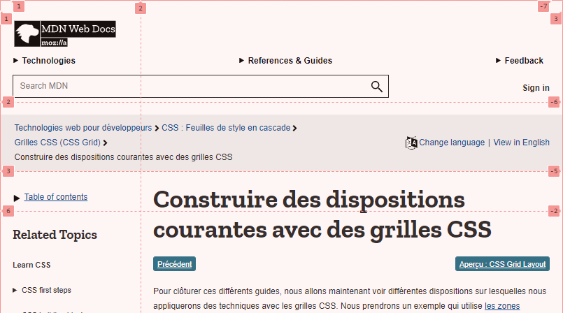
[developer.mozilla.org](https://developer.mozilla.org/fr/docs/Web/CSS/CSS_Grid_Layout/Realizing_common_layouts_using_CSS_Grid_Layout)

## Mise en page avec une grille de 12 colonnes

[www.liberation.fr](https://www.liberation.fr/)

## Mise en page d'une liste d'articles

[www.lemonde.fr](https://www.lemonde.fr/)

## Mise en page à plusieurs niveaux
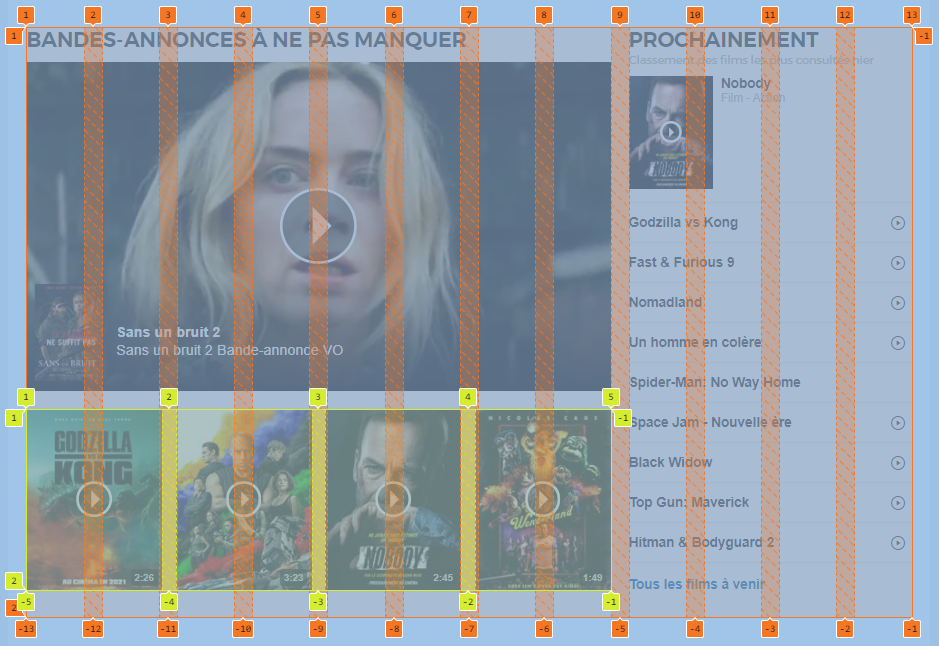
[www.allocine.fr](https://www.allocine.fr/)

## Mise en page d'un header
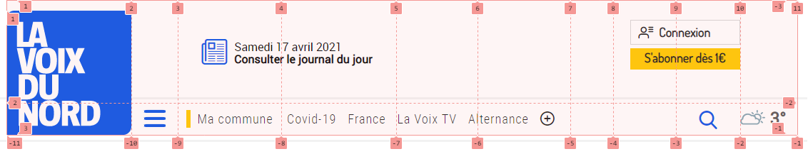
[www.lavoixdunord.fr](https://www.lavoixdunord.fr/)

## Mise en page d'un formulaire
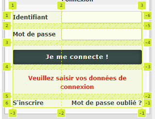
[www.developpez.com](https://www.developpez.com/)

# 3. Grilles et accessibilité
Les grilles CSS font partie de la mise en forme du contenu HTML. La modification d'ordre appliquée par la grille (ou les boîtes flexibles) est uniquement visuelle. C'est toujours le document HTML qui contrôle l'ordre utilisé par les médias non-visuels (tels que la parole, la navigation au clavier ou le parcours des liens). 

> Les développeurs web doivent utiliser les propriétés d'ordre et de placement uniquement pour des raisons visuelles et non pour réordonner logiquement le contenu. Les feuilles de style qui utilisent ces fonctionnalités afin de réordonner les éléments sur le plan logique ne sont pas considérées comme des feuilles de style conformes.

Source : [Les grilles CSS et l'accessibilité](https://developer.mozilla.org/fr/docs/Web/CSS/CSS_Grid_Layout/CSS_Grid_Layout_and_Accessibility)


# 4. Terminologie
La disposition en grille est constituée de colonnes et de lignes qui permettent de placer les éléments des pages.

Les éléments à placer sur la grille peuvent s'étendre sur plusieurs cellules d'une rangée ou d'une colonne, et cela crée une zone (grid area). Les zones doivent être rectangulaires.

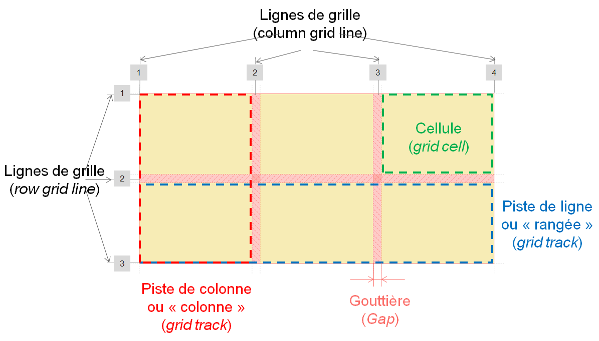


# 5. Création d'une grille CSS
## 5.1 Création de la grille
> Pour expérimenter par vous même, vous pouvez [télécharger le code HTML / CSS de départ de ce cours](https://github.com/mdn/learning-area/blob/master/css/css-layout/grids/0-starting-point.html).

Pour créer un positionnement en grille, on commence par créer une **```balise conteneur```** des éléments de la grille à mettre en page (ici 7 div).
```html
<div class="container">
    <div>One</div>
    <div>Two</div>
    <div>Three</div>
    <div>Four</div>
    <div>Five</div>
    <div>Six</div>
    <div>Seven</div>
</div>
```

Ensuite, on créé la grille en CSS sur l'élément conteneur :  tous les **```enfants directs```** du conteneur de la grille deviennent des **```éléments de grille```**.
```css
.container {
    display: grid;
}
```
Pour le moment, la grille ne comporte qu'une seule colonne. Nous allons créer une grille de 3 colonnes de 200px.
```css
.container {
    display: grid;
    grid-template-columns: 200px 200px 200px;
}
```
> Evidemment, on peut utiliser n'importe quelle unité de largeur ou des pourcentages pour définir la largeur des colonnes.

Nous venons de crééer **```3 pistes de colonnes```** !

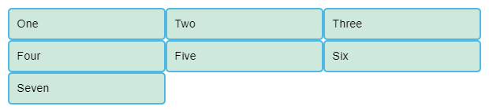


## 5.2 Grilles flexibles avec l'unité "fr"
Nous pouvons utiliser l'unité "**```fr```**" pour moduler la taille des lignes et colonnes de la grille. Cette unité représente une ```fraction de l'espace disponible du conteneur``` de grille.

On peut donc créer 3 pistes de colonnes flexibles comme ceci :
```css
.container {
    display: grid;
    grid-template-columns: 1fr 1fr 1fr;
}
```

Avec l'unité "fr", l'espace est distribué  proportionnellement. Vous pouvez donc affecter des valeurs différentes à chaque piste, par exemple :
```css
.container {
    display: grid;
    grid-template-columns: 2fr 1fr 1fr;
}
```
La largeur disponible est alors décomposée en 4fr (2+1+1). La première colonne occupe la moité de l'espace disponible (2fr/4fr = 1/2).

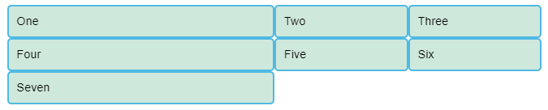

Il est possible de mélanger des dimensions absolues et des relatives - dans ce cas, l'espace nécessaire aux chaînes de largeur fixée est réservé avant la distribution proportionnelle de l'espace restant aux autres chaînes.

Par exemple avec :
```css
grid-template-columns: 500px 1fr 2fr;
```
La première colonne faisant 500px, cette valeur est soustraite de l'espace disponible. L'espace restant est divisé en trois et alloué proportionnellement aux deux colonnes spécifiées avec l'unité relative fr

## 5.3 Espaces entre pistes : les gouttières
Pour créer des "gouttières" entre les pistes, nous nous servons des propriétés **```grid-column-gap```** et **```grid-row-gap```** pour, respectivement, les espacements entre colonnes et entre lignes ; la propriété **```grid-gap```** définit les deux d'un coup.
```css
.container {
    display: grid;
    grid-template-columns: 2fr 1fr 1fr;
    grid-gap: 20px;
}
```

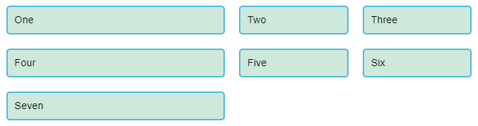

> Ces espacements peuvent être définis avec n'importe quelle unité de longueur ou un pourcentage, mais pas avec l'unité fr

## 5.4 Utiliser la notation repeat() pour définir les pistes
Pour les grilles comprenant de nombreuses pistes on peut utiliser la notation repeat() pour répéter toute ou une partie des pistes définies.  Par exemple, ici nous obtiendrons 3 pistes de 1fr de large :
```css
.container {
    display: grid;
    grid-template-columns: repeat(3, 1fr);
    grid-gap: 20px;
}
```

## 5.5 Grille implicite et grille explicite
Dans ces exemples nous avons défini nos colonnes à l'aide de la propriété ```grid-template-columns```, et nous avons laissé la grille créer les rangées. Ces rangées font partie de la **```grille implicite```**.

La **```grille explicite```** est constituée des pistes définies par les propriétés ```grid-template-columns``` et ```grid-template-rows```. Si un élément est placé en dehors de la grille ainsi définie, ou que la quantité de contenu nécessite d'étendre la grille, alors la grille ajoute implicitement des colonnes et rangées. Les dimensions de ces pistes auront par défaut la valeur ```auto```, c'est-à dire qu'elles s'ajusteront à leur contenu.

On peut définir une taille pour les pistes de la grille implicite grâce aux propriéts **```grid-auto-rows```** et **```grid-auto-columns```**.
```css
.container {
  display: grid;
  grid-template-columns: repeat(3, 1fr);
  grid-auto-rows: 100px;
  grid-gap: 20px;
}
```

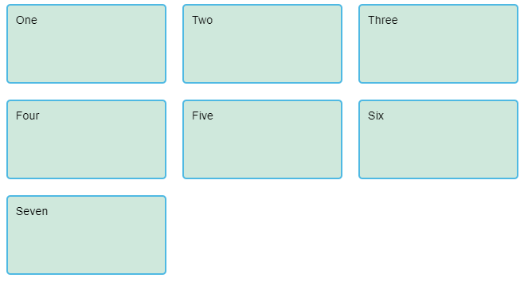


## 5.6 Dimensionner une piste avec minmax
Il peut être utile d'assigner une taille minimum, qui s'agrandit pour s'adapter au contenu. Par exemple on peut souhaiter que les rangées ne soient jamais moins hautes que 100 pixels, mais qu'elles aillent jusqu'à 300 pixels de haut si le contenu le nécessite.

La fonction **```minmax()```** permet ce comportement. Dans l'exemple suivant nous utilisons minmax() comme valeur de la propriété ```grid-auto-rows```. Les rangées créées automatiquement feront un minimum de 100 pixels, et un maximum de auto, ce qui signifie que la taille s'adaptera à la hauteur du contenu.
```css
.container {
  display: grid;
  grid-template-columns: repeat(3, 1fr);
  grid-auto-rows: minmax(100px, auto);
  grid-gap: 20px;
}
```

## 5.7 Autant de colonnes que possibles
On peut créer automatiquement autant de chaînes que possibles dans un conteneur. Il faut utiliser **```repeat()```** avec **```auto-fill```** à la place du nombre de pistes.
```css
.container {
    display: grid;
    grid-template-columns: repeat(auto-fill, minmax(250px, 1fr));
    grid-auto-rows: minmax(100px, auto);
    grid-gap: 20px;
}
```

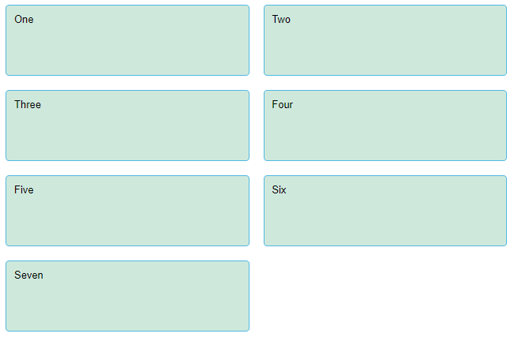

Il a été créé autant de colonnes de 250 pixels qu'il y a de place dans le conteneur, puis l'espace restant a été partagé entre toutes les colonnes.


# 6. Positionner les éléments sur les lignes
## 6.1 Les lignes de grilles
Il faut noter que l'on définit les pistes d'une grille, et pas les lignes qui en résultent. La grille génère des **```lignes numérotées```** que l'on utilise pour positionner les éléments. 

Dans une grille de trois colonnes et deux rangées, nous avons quatre lignes de colonnes et 3 lignes de rangées.

> Les numéros de lignes commencent à 1 et sont placés dans le sens de la lecture. Ils sont visibles dans les navigateurs : F12 > Eléments > Layout

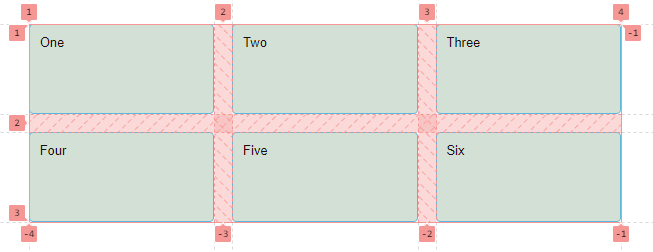

## 6.2 Positionnement sur les lignes
Lorsque nous plaçons un élément nous ciblons une ligne plutôt qu'une piste.

Nous pouvons placer les éléments dans ces lignes en indiquant les lignes de début et de fin. Pour ce faire, nous utilisons les propriétés suivantes :
* [grid-column-start](https://developer.mozilla.org/fr/docs/Web/CSS/grid-column-start)
* [grid-column-end](https://developer.mozilla.org/fr/docs/Web/CSS/grid-column-end)
* [grid-row-start](https://developer.mozilla.org/fr/docs/Web/CSS/grid-row-start)
* [grid-row-end](https://developer.mozilla.org/fr/docs/Web/CSS/grid-row-end)

Ces propriétés acceptent toutes un numéro de ligne comme valeur. Vous pouvez également utiliser les formes abrégées de ces propriétés :
* [grid-column](https://developer.mozilla.org/fr/docs/Web/CSS/grid-column)
* [grid-row](https://developer.mozilla.org/fr/docs/Web/CSS/grid-row)

Cela vous permet de définir les lignes de départ et de fin simultanément, en les séparant avec un **```/```** (un slash).

Nous allons partir d'un exemple pour mettre en oeuvre le positionnement sur les lignes de la grille.

> Pour expérimenter par vous même, vous pouvez [télécharger le code HTML / CSS support de cet exemple](https://github.com/mdn/learning-area/blob/master/css/css-layout/grids/8-placement-starting-point.html)

Pour un conteneur HTML contenant 4 enfants directs :
```html
<div class="container">
    <header>This is my lovely blog</header>
    <article>
        <h1>My article</h1>
        <p>Duis felis orci, pulvinar ...</p>
        <p>Nam vulputate diam nec tempor ...</p>
    </article>
    <aside>
        <h2>Other things</h2>
        <p>Nam vulputate diam nec tempor ...</p>
    </aside>
    <footer>Contact me@mysite.com</footer>
</div>
```
et une grille CSS  de 2 colonnes :
```css
.container {
    display: grid;
    grid-template-columns: 1fr 3fr;
    grid-gap: 20px;
}
```
Nous avons l'affichage suivant (avec la visualisation de la grille):

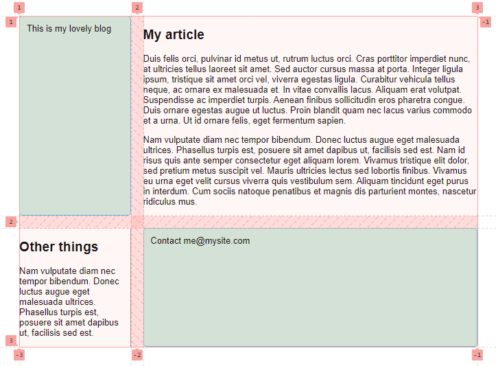

Constatez que le placement automatique met les éléments dans chaque cellule du quadrillage créé.

À la place, nous allons mettre la totalité des éléments du site sur la grille en utilisant les lignes de grille. Ajoutez les règles suivantes à la fin du CSS :
```css
header {
  grid-column: 1 / 3;
  grid-row: 1;
}

article {
  grid-column: 2;
  grid-row: 2;
}

aside {
  grid-column: 1;
  grid-row: 2;
}

footer {
  grid-column: 1 / 3;
  grid-row: 3;
}
```

Nous avons maintenant une toute autre disposition des éléments :

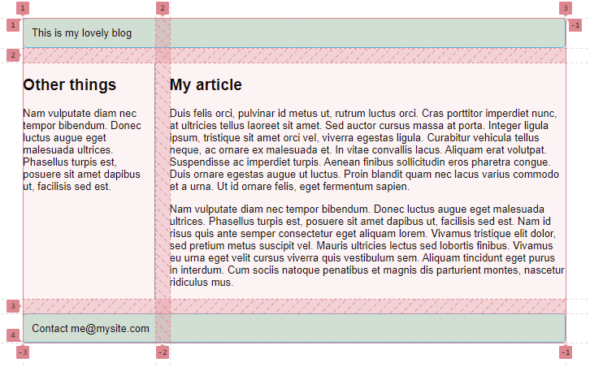

## 6.3 Plus d'infos
* [MDN Placer les éléments sur les lignes d'une grille CSS](https://developer.mozilla.org/fr/docs/Web/CSS/CSS_Grid_Layout/Line-based_Placement_with_CSS_Grid)

# 7. Positionner les éléments avec des zones nommées
## 7.1 Positionnement avec des zones nommées
Une autre façon de placer des éléments dans le quadrillage consiste à utiliser la propriété **``` grid-template-areas```** et à donner un nom au divers éléments du design avec **``` grid-area```** :
* [grid-template-areas](https://developer.mozilla.org/fr/docs/Web/CSS/grid-template-areas)
* [grid-area](https://developer.mozilla.org/fr/docs/Web/CSS/grid-area)

Nous allons partir du même exemple que précédemment pour mettre en oeuvre le positionnement avec des zones nommées.

> Supprimez le placement sur les lignes du dernier exemple (ou bien [re-téléchargez le fichier pour avoir un nouveau point de départ](https://github.com/mdn/learning-area/blob/master/css/css-layout/grids/8-placement-starting-point.html)).

Pour un conteneur HTML contenant 4 enfants directs :
```html
<div class="container">
    <header>This is my lovely blog</header>
    <article>
        <h1>My article</h1>
        <p>Duis felis orci, pulvinar ...</p>
        <p>Nam vulputate diam nec tempor ...</p>
    </article>
    <aside>
        <h2>Other things</h2>
        <p>Nam vulputate diam nec tempor ...</p>
    </aside>
    <footer>Contact me@mysite.com</footer>
</div>
```
et une grille CSS  de 2 colonnes :
```css
.container {
    display: grid;
    grid-template-columns: 1fr 3fr;
    grid-gap: 20px;
}
```

Il faut nommer les éléments de grille (enfants directs du conteneur de la grille) avec la propriété **```grid-area```** :
```css
header {
  grid-area: header;
}

article {
  grid-area: content;
}

aside {
  grid-area: sidebar;
}

footer {
  grid-area: footer;
}
```

Grâce à ces noms, on peut créer l'organisation. Cette fois, plutôt que de placer les objets grâce aux numéros de ligne, on définit la disposition dans le conteneur de la grille en se servant de la propriété **```grid-template-areas```** :
```css
.container {
    margin: 50px;
    display: grid;
    grid-template-areas:
        "header header"
        "sidebar content"
        "footer footer";
    grid-template-columns: 1fr 3fr;
    grid-gap: 20px;
}
```

Grâce à cette méthode, il n'est pas nécessaire de gérer chacun des éléments individuellement. Tout est organisé au travers du conteneur.

Le résultat graphique est identique.

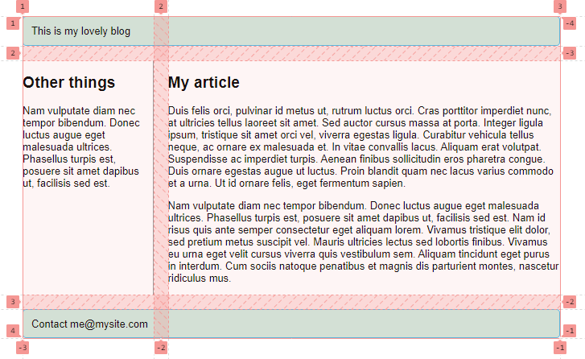

Les règles pour **```grid-template-areas```** sont les suivantes :
* toute cellule du quadrillage doit être remplie
* pour couvrir deux cellules, répétez le nom
* pour laisser une cellule vide, utilisez un point **```.```** 
* les zones doivent être rectangulaires, vous ne pouvez pas avoir une zone en L par exemple
* les zones ne peuvent pas être répétées dans des emplacements différents

Vous pouvez jouer avec la disposition, en modifiant le pied de page pour qu'il ne soit placé que sous le contenu et que la barre latérale soit sur toute la hauteur de la page, par exemple. C'est une très belle façon de décrire une disposition, car elle est évidente à la seule lecture de la CSS.

## 7.2 Plus d'infos
* [MDN Définir des zones sur une grille](https://developer.mozilla.org/fr/docs/Web/CSS/CSS_Grid_Layout/Grid_Template_Areas)


# 8. L'alignement des boîtes avec les grilles CSS
Documentation : 
* [CSS Box Alignment](https://developer.mozilla.org/fr/docs/Web/CSS/CSS_Box_Alignment)
* [L'alignement des boîtes avec les grilles CSS](https://developer.mozilla.org/fr/docs/Web/CSS/CSS_Grid_Layout/Box_Alignment_in_CSS_Grid_Layout)

# 9. Documentation
* [Les concepts de base des grilles CSS](https://developer.mozilla.org/fr/docs/Web/CSS/CSS_Grid_Layout/Basic_Concepts_of_Grid_Layout)
* [Référence Grille CSS](https://developer.mozilla.org/fr/docs/Web/CSS/CSS_Grid_Layout)
* [CSS Grid Layout, guide complet](https://la-cascade.io/css-grid-layout-guide-complet/)
* [Grilles](https://developer.mozilla.org/fr/docs/Learn/CSS/CSS_layout/Grids)
* [Construire des dispositions courantes avec des grilles CSS](https://developer.mozilla.org/fr/docs/Web/CSS/CSS_Grid_Layout/Realizing_common_layouts_using_CSS_Grid_Layout)