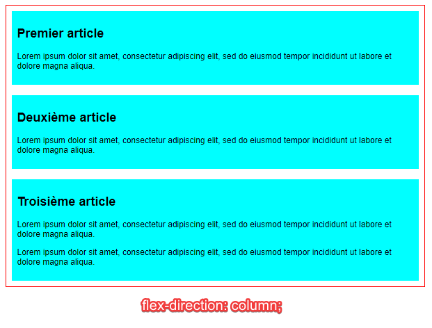
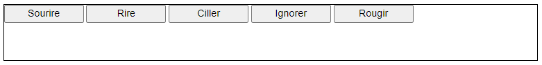

# Mise en page CSS : ```Flexbox```

> * Auteur : Gwénaël LAURENT
> * Date : 26/04/2021
> * OS : Windows 10 (version 20H2)
> * Chrome : version 90.0.4430.85

- [Mise en page CSS : ```Flexbox```](#mise-en-page-css--flexbox)
- [1. Concepts de base pour Flexbox](#1-concepts-de-base-pour-flexbox)
- [2. Les deux axes des boîtes flexibles](#2-les-deux-axes-des-boîtes-flexibles)
  - [2.1 L'axe principal](#21-laxe-principal)
  - [2.2 L'axe secondaire (cross axis)](#22-laxe-secondaire-cross-axis)
- [3. Les lignes de début et de fin](#3-les-lignes-de-début-et-de-fin)
- [4. Conteneur flexible](#4-conteneur-flexible)
- [5. Modifier ```flex-direction```](#5-modifier-flex-direction)
- [6. Passage à la ligne automatique avec ```wrap```](#6-passage-à-la-ligne-automatique-avec-wrap)
- [7. Forme abrégée pour direction et wrap ```flex-flow```](#7-forme-abrégée-pour-direction-et-wrap-flex-flow)
- [8. Taille modulable des éléments flex](#8-taille-modulable-des-éléments-flex)
- [9. Répartir l'espace libre grâce à l'alignement](#9-répartir-lespace-libre-grâce-à-lalignement)
- [10. Documentation](#10-documentation)


# 1. Concepts de base pour Flexbox
Le module des boîtes flexibles (*CSS Flexible Box Layout*), aussi appelé « flexbox », a été conçu comme un modèle de **```disposition unidimensionnel```** et comme une méthode permettant de ```distribuer l'espace entre des objets d'une interface ainsi que de les aligner```.

> Donc, contrairement à Grid Layout, flexbox gère une seule dimension à la fois : une ligne ou une colonne

Grâce au positionnement flexbox on peut enfin :
* centrer verticalement un bloc de contenu dans son parent ;
* faire que tous les enfants d'un conteneur occupent tous une même quantité de hauteur/largeur disponible selon l'espace offert ;
* faire que toutes les colonnes dans une disposition multi‑colonnes aient la même hauteur même si leur quantité de contenu diffère.

On créé le positionnement flexible à l'intérieur d'un ```élément conteneur``` en lui appliquant la déclaration CSS : **```display: flex;```**

# 2. Les deux axes des boîtes flexibles
## 2.1 L'axe principal
L'axe principal est défini par la propriété **```flex-direction```** qui peut prendre quatre valeurs :
* row
* row-reverse
* column
* column-reverse

Si on choisit la valeur **```row```**, l'axe principal sera aligné avec la direction « en ligne » (inline direction) (c'est la direction logique qui suit le sens d'écriture du document).


Si on choisit la valeur **```column```**, l'axe principal suivra la direction de bloc (block direction) et progressera le long de l'axe perpendiculaire au sens d'écriture.


## 2.2 L'axe secondaire (cross axis)
L'axe secondaire est ```perpendiculaire à l'axe principal```. 
* Ainsi, si flex-direction vaut row, l'axe secondaire suivra l'axe des colonnes.
* Si l'axe principal est column, l'axe secondaire suivra celui des lignes (horizontales).


# 3. Les lignes de début et de fin
La disposition flexible s'adapte à tous les sens d'écriture, on ne parlera donc pas de gauche ou droite, mais de **```début (start)```** ou **```fin (end)```**

Start et End correspondent au sens d'écriture du document pour la langue choisie. 

Ainsi, pour un document en français :


Mais pour un document en arabe :


# 4. Conteneur flexible
Pour créer un positionnement flexible, on commence par créer une **```balise conteneur```** qui contiendra les éléments à positionner (ici le conteneur est la balise ```<section>``` qui contient 3 balises ```<article>```). Cette balise délimitera la zone avec mise en page flexible.
```html
<section>
    <article>
        <h2>Premier article</h2>
        <p>Lorem ipsum dolor sit amet, consectetur adipiscing elit, sed do eiusmod tempor incididunt ut labore
            et dolore magna aliqua.</p>
    </article>

    <article>
        <h2>Deuxième article</h2>
        <p>Lorem ipsum dolor sit amet, consectetur adipiscing elit, sed do eiusmod tempor incididunt ut labore
            et dolore magna aliqua.</p>
    </article>

    <article>
        <h2>Troisième article</h2>
        <p>Lorem ipsum dolor sit amet, consectetur adipiscing elit, sed do eiusmod tempor incididunt ut labore
            et dolore magna aliqua.</p>
        <p>Lorem ipsum dolor sit amet, consectetur adipiscing elit, sed do eiusmod tempor incididunt ut labore
            et dolore magna aliqua.</p>
    </article>
</section>
```
Avec un minimum de style CSS :
```css
section {
    width: 800px;
    border: 2px solid red;
}

article {
    padding: 10px;
    margin: 10px;
    background: aqua;
}
```

Ensuite, on créé le positionnement flexible en CSS sur l'élément conteneur avec **```display: flex```** :
* Le conteneur devient flexible (par défaut, suivant l'axe horizontal)
* tous les **```enfants directs```** du conteneur deviennent des **```éléments flexibles (flex items)```**.


```css
section {
  display: flex;
}
```


> Notez que les balises ```<article>``` n'ont plus leur comportement standard de boîte en bloc. Elles se placent maintenant sur la même ligne !

Par défaut, les éléments flexibles se comportent de la façon suivante :
* Les éléments s'afficheront en lignes horizontales (la valeur par défaut de la propriété flex-direction est row).
* Les éléments seront placés à partir de la ligne de début de l'axe principal.
* Les éléments ne s'étireront pas le long de l'axe principal mais pourront se rétrécir si nécessaire.
* Les éléments seront étirés le long de l'axe secondaire afin d'occuper l'espace sur cet axe.


# 5. Modifier ```flex-direction```





# 6. Passage à la ligne automatique avec ```wrap```
Si votre structure est de largeur ou hauteur fixe il arrive que les éléments flex débordent du conteneur et brisent cette structure.

Exemple en ajoutant 4 articles dans notre conteneur de 800px :


Une façon d'y remédier est :
* d'ajouter la déclaration **```flex-wrap: wrap;```** à votre règle pour section
* et de définir que chaque article dispose au moins de 200px de large avec ```flex: 200px;```

```css
section {
    display: flex;
    flex-direction: row;
    flex-wrap: wrap;
}
article {
    flex: 200px;
}
```


> Remarquez que le dernière article est plus large que les autres, de façon à ce que toute la rangée reste remplie.

# 7. Forme abrégée pour direction et wrap ```flex-flow```
Il y a une forme abrégée pour flex-direction et flex-wrap : **```flex-flow```**. Ainsi, par exemple, vous pouvez remplacer :
```css
flex-direction: row;
flex-wrap: wrap;
```
par
```css
flex-flow: row wrap;

```

# 8. Taille modulable des éléments flex
On peut contrôler les proportions des éléments flexibles le long de l'axe principal en fonction de l'espace disponible dans le conteneur.

**Espace libre positif** : Le conteneur flexible dispose de plus d'espace qu'il n'est nécessaire pour afficher les éléments flexibles qu'il contient. 


**Espace libre négatif** : C'est l'espace supplémentaire qui aurait été nécessaire pour contenir tous les éléments à l'intérieur du conteneur flexible.


La propriété CSS **```flex```** permet de gérer la largeur d'un "flex item". C'est une propriété abrégée qui regroupe les valeurs de 3 propriétés :
* [flex-grow](https://developer.mozilla.org/fr/docs/Web/CSS/flex-grow) : coefficient d'expansion d'un élément flexible. ```Utilisé si l'espace libre est positif```
* [flex-shrink](https://developer.mozilla.org/fr/docs/Web/CSS/flex-shrink) : coefficient de rétrécissement d'un élément flexible. ```Utilisé si l'espace libre est négatif```
* [flex-basis](https://developer.mozilla.org/fr/docs/Web/CSS/flex-basis) : taille initiale pour un élément flexible, à partir de laquelle la flexibilité opère ... en expansion ou en rétrécissement.

Par défaut, les valeurs de ces propriétés sont : flex-grow: 0, flex-shrink: 1 et flex-basis: auto. 
* En clair, les flex-items n’occupent initialement que la taille minimale de leur contenu.
* On peut écrire cette valeur avec la déclaration : ```flex: 0 1 auto;```

Exemple d'utilisation de la propriété flex dans notre exemple avec 3 articles seulement: 

Modifiez les propriétés flex des articles
```css
article {
    flex: 1;
}
article:nth-child(3) {
    flex: 2;
}
```


> Ici on utilise une forme abrégée de flex à une seule valeur qui correspond à flex-grow.

Le 3ème article occupe 2/4 de l'espace disponible (= 1 + 1 + 2 = 4)

On peut également définir une valeur minimale de taille dans la valeur flex. Modifiez comme suit vos règles article existantes :
```css
article {
    flex: 1 200px;
}
article:nth-child(3) {
    flex: 2 200px;
}
```


> Ici on utilise une autre forme abrégée de flex à deux valeurs qui correspond à flex-grow puis flex-basis

Tous les articles font 200px de large plus une proportion de l'espace disponible. Le 3ème article occupe 200px + 2/4 de l'espace disponible.

Documentation : [Contrôler les proportions des boîtes flexibles le long de l'axe principal](https://developer.mozilla.org/fr/docs/Web/CSS/CSS_Flexible_Box_Layout/Controlling_Ratios_of_Flex_Items_Along_the_Main_Ax)


# 9. Répartir l'espace libre grâce à l'alignement
Nous allons le transformer facilement en une barre souple de boutons.
```html
<div>
  <button>Sourire</button>
  <button>Rire</button>
  <button>Ciller</button>
  <button>Ignorer</button>
  <button>Rougir</button>
</div>
```
Avec un minimum de style CSS :
```css
div {
  height: 100px;
  border: 1px solid black;
}
button {
  font-size: 18px;
  line-height: 1.5;
  width: 15%;
}
```

Actuellement, nous avons une barre de menu horizontale avec quelques boutons tassés dans l'angle supérieur gauche.



Ajoutez ce qui suit à la fin de la CSS :
```css
div{
    display: flex;
    align-items: center;
    justify-content: space-between;
}
```
Les boutons sont maintenant bien centrés, horizontalement et verticalement.


Pour aligner les éléments à partir du conteneur :
* [justify-content](https://developer.mozilla.org/fr/docs/Web/CSS/justify-content) indique la façon dont l'espace doit être réparti entre et autour des éléments selon l'axe principal d'un conteneur flexible
* [align-items](https://developer.mozilla.org/fr/docs/Web/CSS/align-items) contrôle l'alignement des éléments par rapport à l'axe secondaire (cross axis).


Documentation : 
* [CSS Box Alignment](https://developer.mozilla.org/fr/docs/Web/CSS/CSS_Box_Alignment)
* [Aligner des éléments dans un conteneur flexible](https://developer.mozilla.org/fr/docs/Web/CSS/CSS_Flexible_Box_Layout/Aligning_Items_in_a_Flex_Container)

# 10. Documentation
* [Flexbox](https://developer.mozilla.org/fr/docs/Learn/CSS/CSS_layout/Flexbox)
* [Les concepts de base pour flexbox](https://developer.mozilla.org/fr/docs/Web/CSS/CSS_Flexible_Box_Layout/Basic_Concepts_of_Flexbox)
* [Disposition des boîtes flexibles CSS](https://developer.mozilla.org/fr/docs/Web/CSS/CSS_Flexible_Box_Layout)
* [Aligner des éléments dans un conteneur flexible](https://developer.mozilla.org/fr/docs/Web/CSS/CSS_Flexible_Box_Layout/Aligning_Items_in_a_Flex_Container)
* [L alignement des boîtes avec Flexbox](https://developer.mozilla.org/fr/docs/Web/CSS/CSS_Box_Alignment/Box_Alignment_in_Flexbox)

