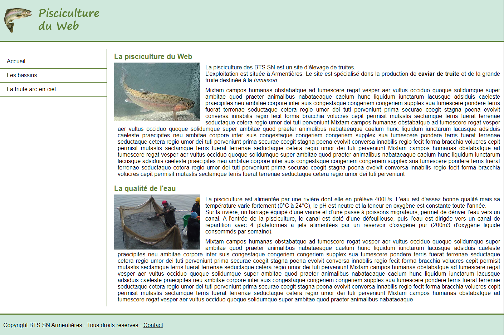
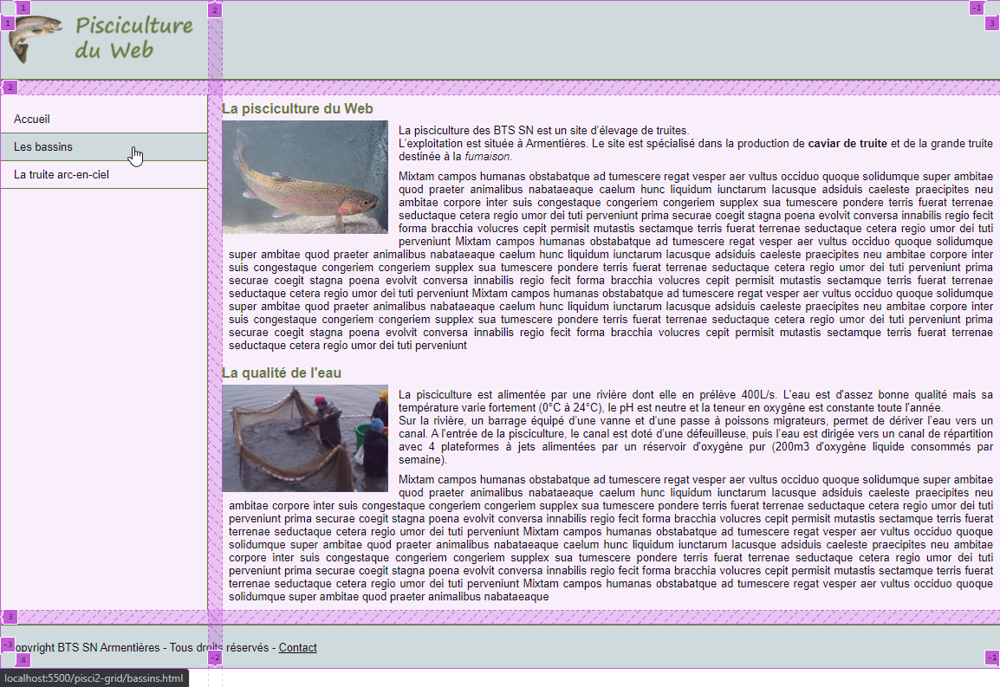

# TP Grid 1 : Mise en page avec les grilles CSS

> * Auteur : Gwénaël LAURENT
> * Date : 19/04/2021
> * OS : Windows 10 (version 20H2)
> * Chrome : version 90.0.4430.72


- [TP Grid 1 : Mise en page avec les grilles CSS](#tp-grid-1--mise-en-page-avec-les-grilles-css)
- [1. Résultat final "Pisciculture du Web" version 1](#1-résultat-final-pisciculture-du-web-version-1)
- [2. Contraintes à respecter](#2-contraintes-à-respecter)
- [3. Grille globale](#3-grille-globale)
- [4. Charte graphique "Pisciculture du Web"](#4-charte-graphique-pisciculture-du-web)
  - [4.1 Paramétrage global](#41-paramétrage-global)
  - [4.2 Vert clair rgb(207, 232, 220)](#42-vert-clair-rgb207-232-220)
  - [4.3 Vert moyen rgb(92, 127, 51)](#43-vert-moyen-rgb92-127-51)


# 1. Résultat final "Pisciculture du Web" version 1
Vous allez réalisez la mise en page du site "Pisciculture du Web"
* Le HTML et les images sont donnés
* à vous de faire le CSS

La page d'accueil souhaitée :



# 2. Contraintes à respecter
La mise en page ne ciblera que les grands écrans (1024px à 1920px).
> Le site ne doit pas être complètement responsive, mais dans la mesure du possible, essayez de paramétrer la grille pour avoir un minimum de flexibilité. 

Compatibilité des navigateurs :
* Chrome, Firefox, Edge

Organisation du CSS :
* Respecter les zones définies par les commentaires
* On essaye d'ordonner les règles CSS en suivant le flux d'affichage normal


Techniques à utiliser :
* **```Les grilles CSS```**
* Les techniques standards de CSS
* La taille du texte est définie de façon globale à 0.625rem et est redéfinie dans les différentes zones (1.6rem pour le texte standard)
* Toutes les dimensions doivent utiliser l'unité ```rem``` (root em)
* **```Interdiction d'utiliser Flexbox```** pour cet exercice ! L'objectif est de travailler les grilles CSS.

Documentation sur l'intérêt de l'unité rem : [grafikart.fr/tutoriels/font-size-rem-em-px-477](https://grafikart.fr/tutoriels/font-size-rem-em-px-477)


# 3. Grille globale
Vous devrez utiliser un **```CSS Grid Layout```** pour la mise en page globale du site.

* Sélecteur : ```.container```
* Paramètrage de la grille :
  * 2 colonnes : la première fait 30rem de large
  * 3 lignes : implicites 
  * grid-gap : 2rem;
  * Positionnez les éléments sur les lignes de la grille à l'aide de **```grid-column```** et **```grid-row```** (pas de zones nommées)




# 4. Charte graphique "Pisciculture du Web"
## 4.1 Paramétrage global
* marge et remplissage : 0
* police de caractère : Arial, Verdana, sans-serif
* taille du texte : 0.625rem;  /* 1rem = 10px */
* texte : black
* fond : white


## 4.2 Vert clair rgb(207, 232, 220)
* fond des header et footer
* fond du menu au survol de la souris


## 4.3 Vert moyen rgb(92, 127, 51)
* Bordure des header et footer (0.3rem)
* Bordure entre les items du menu (0.1rem)


