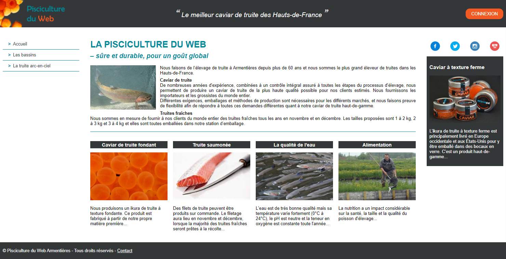
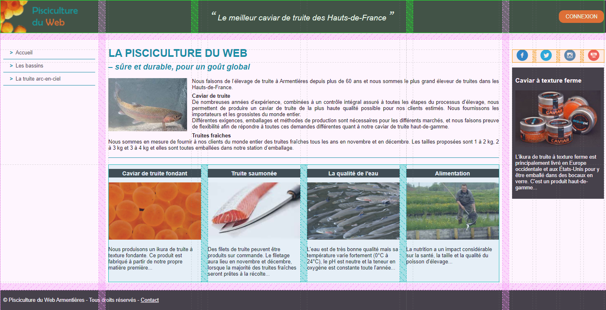
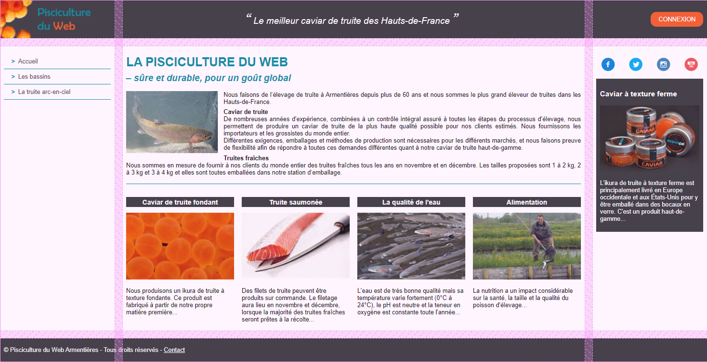
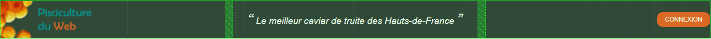
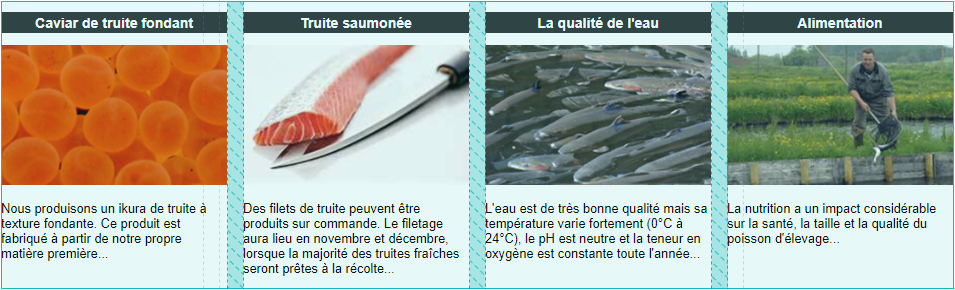

# TP Grid 2 : Mise en page avec les grilles CSS

> * Auteur : Gwénaël LAURENT
> * Date : 20/04/2021
> * OS : Windows 10 (version 20H2)
> * Chrome : version 90.0.4430.72


- [TP Grid 2 : Mise en page avec les grilles CSS](#tp-grid-2--mise-en-page-avec-les-grilles-css)
- [1. Résultat final "Pisciculture du Web" version 2](#1-résultat-final-pisciculture-du-web-version-2)
- [2. Contraintes à respecter](#2-contraintes-à-respecter)
- [3. Les différents Grid Layout](#3-les-différents-grid-layout)
  - [3.1 Quatre grilles pour la mise en page complète](#31-quatre-grilles-pour-la-mise-en-page-complète)
  - [3.2 Grille globale](#32-grille-globale)
  - [3.3 Grille pour le contenu du header](#33-grille-pour-le-contenu-du-header)
  - [3.4 Grille pour les articles secondaires](#34-grille-pour-les-articles-secondaires)
  - [3.5 Grille pour les liens des média sociaux](#35-grille-pour-les-liens-des-média-sociaux)
- [4. Charte graphique "Pisciculture du Web"](#4-charte-graphique-pisciculture-du-web)
  - [4.1 Paramétrage global](#41-paramétrage-global)
  - [4.2 Logo](#42-logo)
  - [4.3 Gris foncé rgb(51, 55, 56)](#43-gris-foncé-rgb51-55-56)
  - [4.4 Bleu rgb(0, 140, 157)](#44-bleu-rgb0-140-157)
  - [4.5 Orange rgb(241, 90, 34)](#45-orange-rgb241-90-34)

> Remerciements : La mise en page proposée est librement inspiré de https://www.aquapri.dk/fr/

# 1. Résultat final "Pisciculture du Web" version 2
Vous allez réalisez la mise en page du site "Pisciculture du Web"
* Le HTML et les images sont donnés
* à vous de faire le CSS

La page d'accueil souhaitée :



# 2. Contraintes à respecter
La mise en page ne ciblera que les grands écrans (1200px à 1920px).
> Le site ne doit pas être complètement responsive, mais dans la mesure du possible, essayez de paramétrer les grilles pour avoir un minimum de flexibilité. 

Compatibilité des navigateurs :
* Chrome, Firefox, Edge

Organisation du CSS :
* Respecter les zones définies par les commentaires
* On essaye d'ordonner les règles CSS en suivant le flux d'affichage normal


Techniques à utiliser :
* **```Les grilles CSS```**
* Les techniques standards de CSS
* La taille du texte est définie de façon globale à 0.625rem et est redéfinie dans les différentes zones (1.6rem pour le texte standard)
* Toutes les dimensions doivent utiliser l'unité ```rem``` (root em)
* **```Interdiction d'utiliser Flexbox```** pour cet exercice ! L'objectif est de travailler les grilles CSS.

Documentation sur l'intérêt de l'unité rem : [grafikart.fr/tutoriels/font-size-rem-em-px-477](https://grafikart.fr/tutoriels/font-size-rem-em-px-477)

# 3. Les différents Grid Layout
## 3.1 Quatre grilles pour la mise en page complète
Vous devrez utiliser 4 grilles pour la mise en page.



## 3.2 Grille globale
* Sélecteur : ```.container```
* Paramètrage de la grille :
  * 3 lignes
  * 3 colonnes : la première et la dernière font 30rem
  * grid-gap : 2rem;
  * utilisez des **```zones nommées```** pour placer les éléments dans la grille



## 3.3 Grille pour le contenu du header
* Sélecteur : ```.main-head```
* Paramètrage de la grille :
  * 1 ligne
  * 3 colonnes
  * grid-gap : 2rem;
* Pour adapter le logo à la hauteur max du header
  ```css
  .logo-banner {
    height: 100%;
    aspect-ratio: auto 279 / 100;
  }
  ```
* Utilisation des sélecteurs de pseudo-éléments :before et :after pour les guillemets autour de la citation
  ```css
  .main-head > blockquote:before {
    content: "\201C"; /* ou \201D */
    font-family: georgia, serif;
    font-size: 3.6rem;
    color: white;
    padding: 0 0.72rem 0 0;
  }
  ```




## 3.4 Grille pour les articles secondaires
* Sélecteur : ```.content-sec```
* Paramètrage de la grille :
  * colonnes automatiques (largeur minimum de 25rem)
  * lignes automatiques
  * grid-gap : 2rem;
* Pour adapter les images à la largeur des colonnes
  ```css
  .art-sec img {
    width: 100%;
    aspect-ratio: auto 260 / 161;
  }
  ```



## 3.5 Grille pour les liens des média sociaux
* Sélecteur : ```.socialnetworks-links```
* Paramètrage de la grille :
  * 1 ligne
  * colonnes automatiques
  * grid-gap : 1rem;
* Taille des icônes : 3.5rem * 3.5rem


# 4. Charte graphique "Pisciculture du Web"
## 4.1 Paramétrage global
* marge et remplissage : 0
* police de caractère : Arial, Verdana, sans-serif
* taille du texte : 0.625rem;  /* 1rem = 10px */
* texte : black
* fond : white

## 4.2 Logo
* S'adapte à la hauteur du header

## 4.3 Gris foncé rgb(51, 55, 56)
* fond des header et footer
* fond des h2 des articles secondaires
* fond de la publicité (.advert)
* texte des items du menu principal

## 4.4 Bleu rgb(0, 140, 157)
* titres h1 et h2 de l'article principal
* bordure 0.1rem entre les items du menu principal
* Caractère ">" devant les items du menu principal
* bordure 0.1rem après l'article principal

## 4.5 Orange rgb(241, 90, 34)
* Bouton Connexion
* Survol des items du menu principal
