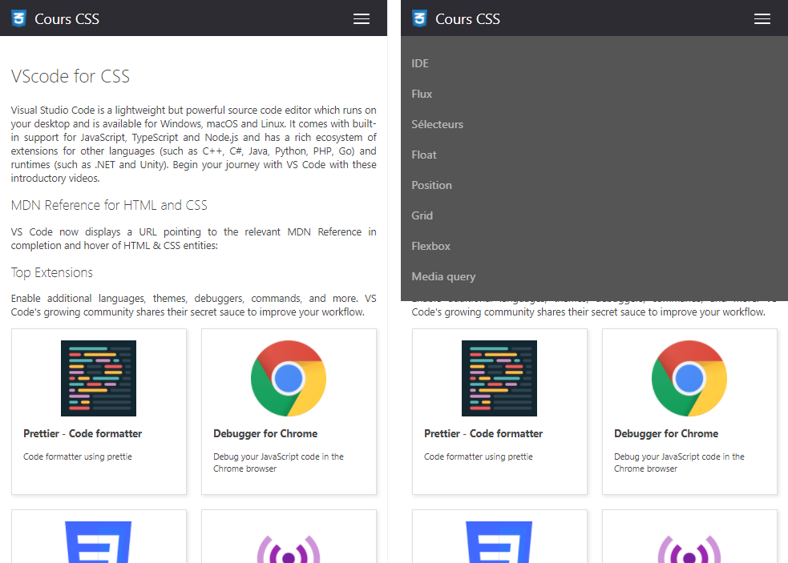
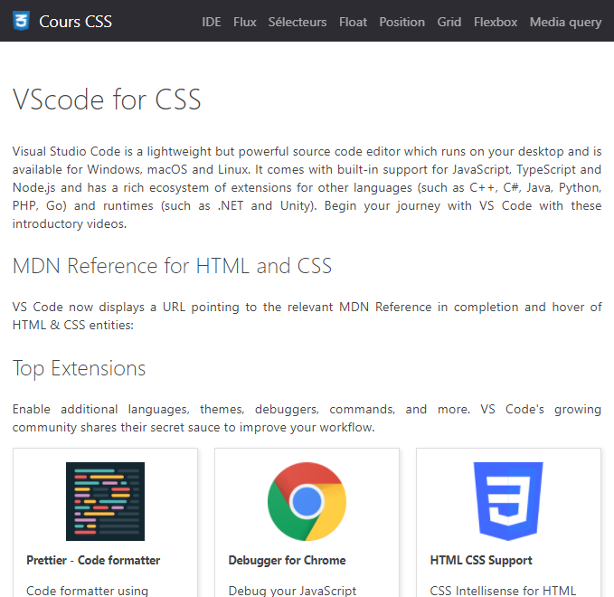
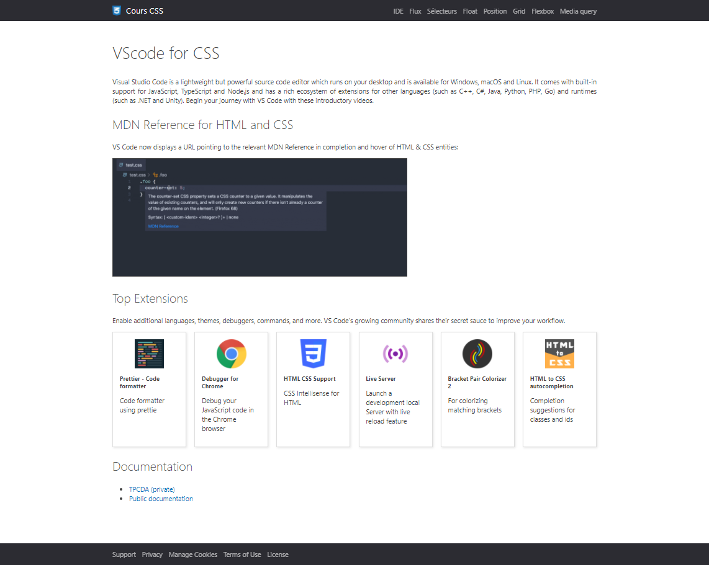
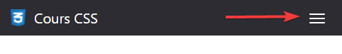

# TP3 : Responsive Web Design avec ```Grid```, ```Flexbox``` et ```Media query```

> * Auteur : Gwénaël LAURENT
> * Date : 20/04/2021
> * OS : Windows 10 (version 20H2)
> * Chrome : version 90.0.4430.72

- [TP3 : Responsive Web Design avec ```Grid```, ```Flexbox``` et ```Media query```](#tp3--responsive-web-design-avec-grid-flexbox-et-media-query)
- [1. Résultat final pour le site "Cours CSS"](#1-résultat-final-pour-le-site-cours-css)
- [2. Contraintes à respecter](#2-contraintes-à-respecter)
- [3. Bouton "toggle" pour afficher / cacher le menu en width <768px](#3-bouton-toggle-pour-afficher--cacher-le-menu-en-width-768px)
- [4. Tailles et couleurs de la police de caractère](#4-tailles-et-couleurs-de-la-police-de-caractère)
- [5. Couleurs de fond](#5-couleurs-de-fond)
- [6. Bordures](#6-bordures)

> Remerciements : La mise en page proposée est librement inspiré de https://code.visualstudio.com/docs


# 1. Résultat final pour le site "Cours CSS"
Vous allez réalisez la mise en page du site "Cours CSS"
* Une ébauche du HTML est donné
* Les images sont données
* à vous de faire le CSS

Le site web sera "**```responsive```**", la mise en page ciblera principalement ```3 largeurs d'écran``` :
* Inférieure à 768px (smartphone portrait)
* Entre 768px et 1200px (smartphone paysage, tablette)
* Supérieure à 1200px (Ordinateurs) 

Largeur inférieure à 768px :

> Notez que le menu s'affiche ```au dessus``` du contenu de l'article



Largeur entre 768px et 1200px :



Largeur supérieure à 1200px :

> La largeur max de l'article est fixé à 1200px avec les marges. Le header et le footer s'étirent sur la largeur max.



# 2. Contraintes à respecter

Le site devra être :
* *responsive* : utilisation des **```media query```**
* *flexible* : utilisation de **``` Grid, Flexbox```**
* *accessible* : utilisation des **``` unités rem```**, des **```alt```**, et d'une bonne **```architecture des titres```**

Compatibilité des navigateurs :
* Chrome, Firefox, Edge

Organisation du CSS :
* Commentez les zones en fonction du but recherché
* Ordonnez les règles CSS en suivant le flux d'affichage normal


Techniques à utiliser :
* Les techniques standards de CSS
* Les Grid Layout, Flexbox Layout, Media Query
* La taille du texte est définie de façon globale dans le sélecteur ```<html>``` à 0.625rem et est redéfinie dans les différentes zones (1.6rem pour le texte standard)
* Toutes les dimensions doivent utiliser l'unité ```rem``` (root em)

> Vous pouvez tester l'accessibilité de votre site en activant le "narrateur" de Windows : Windows + Ctrl + Entrée. Vérifiez entre autre l'architecture HTML (architecture des titres)

> Pour tester le respect des règles : Chrome > F12 > Lightouse > Generate report


# 3. Bouton "toggle" pour afficher / cacher le menu en width <768px


Bouton entièrement créé en HTML/CSS.

Une case à cocher non visible est associée au bouton pour gérer le "clic" entièrement en CSS (sinon, il faut du javascript)

```html
<label for="nav-toggle">
    <span class="nav-toogle-text">Afficher / Cacher le menu</span>
    <div class="nav-toggle-button">
        <span></span>
        <span></span>
        <span></span>
    </div>
</label>
<input type="checkbox" id="nav-toggle">
<nav class="main-nav">
    <ul>
        <li><a href="#">IDE</a></li>
        <li><a href="#">Flux</a></li>
        <li><a href="#">Sélecteurs</a></li>
        <li><a href="#">Float</a></li>
        <li><a href="#">Position</a></li>
        <li><a href="#">Grid</a></li>
        <li><a href="#">Flexbox</a></li>
        <li><a href="#">Media query</a></li>
    </ul>
</nav>
```

```css
.nav-toggle-button {
    display: flex;
    flex-flow: column wrap;
    justify-content: space-between;
    box-sizing: border-box;
    height: 3.2rem;
    width: 4.2rem;
    margin: 1rem 0rem 0.8rem 0;
    padding: 0.9rem 1rem;
    cursor: pointer;
    line-height: 2rem;
}

.nav-toggle-button>span {
    background-color: white;
    display: block;
    width: 2.2rem;
    height: 0.2rem;
    padding: 0;
    border-radius: 0.1rem;
}

#nav-toggle,
.nav-toogle-text {
    display: none;
}

#nav-toggle:checked+nav ul {
    /* Gestion de l'affichage du menu de navigation*/
}
```


# 4. Tailles et couleurs de la police de caractère

> Font-size (en px) en fonction de la largeur d'écran

| Sélecteur  | <768px | >768px | >992px | >1200px | font-weight | color               |
|------------|--------|--------|--------|---------|-------------|---------------------|
| article h1 | 25.5   | 36     | 38     | 4       | lighter     | #444444             |
| article h2 | 18.7   | 27     | 28.5   | 30      | lighter     | #444444             |
| article p  | 14     | 16     | 16     | 16      | normal      | #444444             |
| menu item  | 16     | 16     | 16     | 16      | normal      | #FFFFFF opacity 0.6 |
| footer     | 16     | 16     | 16     | 16      | normal      | #FFFFFF opacity 0.6 |
| gallery h3 | 14     | 16     | 16     | 16      | normal      | #444444             |
| gallery p  | 12     | 16     | 16     | 16      | normal      | #444444             |


# 5. Couleurs de fond
* Header : #2C2C32
* Menu pour width < 768px : #555555
* Menu pour width > 768px : #2C2C32
* Article :  #FFFFFF
* Footer : #2C2C32


# 6. Bordures
* Bordures images de l'article : #444444
* Bordures gallery items :
  ```css
    border: #dedede solid 1px;
    box-shadow: 2px 2px 5px rgba(0, 0, 0, 0.1);
  ```
  