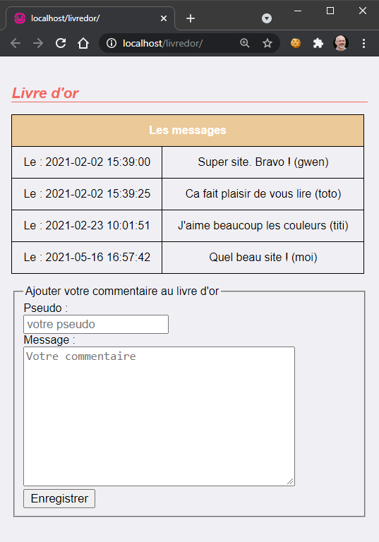
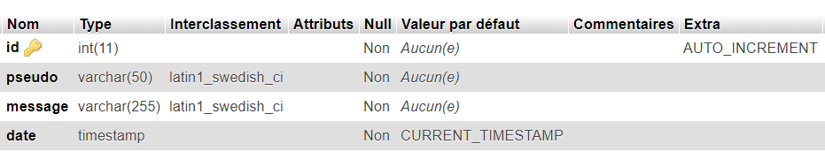

# Mini projet **Livre d'or**

> * Auteur : Gwénaël LAURENT
> * Date : 18/05/2021

- [Mini projet **Livre d'or**](#mini-projet-livre-dor)
- [1. Objectif](#1-objectif)
- [2. Maquette graphique](#2-maquette-graphique)
- [3. Base de données](#3-base-de-données)
- [4. Développement local](#4-développement-local)
- [5. Ressources](#5-ressources)
  - [5.1 formulaire HTML](#51-formulaire-html)
  - [5.2 tableau HTML](#52-tableau-html)
  - [5.3 Requête SQL INSERT](#53-requête-sql-insert)
  - [5.4 Redirection PHP](#54-redirection-php)

# 1. Objectif
Une page web qui permet aux internautes de laisser un commentaire sur le site. Les commentaires sont visibles par tous les internautes.

# 2. Maquette graphique


# 3. Base de données
* Nom de la base : ```livredor```
* Les commentaires sont enregistrés dans la table : ```message```


# 4. Développement local
1. Création d'un alias dans Wampserver : ```livredor```
2. Configuration de VScode : debug Chrome + PHP
3. Création de la base de données : ```livredor```
4. Création de la page HTML ```index.php``` :
   1. Tableau HTML pour afficher les commentaires déjà présent dans la base de données
   2. Formulaire HTML méthode POST pour saisir un nouveau commentaire
   3. La validation du formulaire envoie les données au script PHP ```insertMessage.php```
5. Création du script ```insertMessage.php``` :
   1. récupérer les variables de formulaire ```pseudo``` et ```commentaire``` dans la superglobale $_POST
   2. enregistrement du commentaire dans la base de données
   3. redirection automatique en PHP vers la page ```index.php```

# 5. Ressources
## 5.1 formulaire HTML
```html
<form method="POST" action="insertMessage.php">
    <fieldset>
        <legend>Ajouter votre commentaire au livre d'or</legend>
        Pseudo :
        <input type="text" name="pseudo" value="" placeholder="votre pseudo" required>
        Message :
        <textarea name="commentaire" rows="10" cols="40" placeholder="Votre commentaire" required></textarea>
        <input type="submit" value="Enregistrer">
    </fieldset>
</form>
```
## 5.2 tableau HTML
[MDN Tableaux HTML : notions de base](https://developer.mozilla.org/fr/docs/Learn/HTML/Tables/Basics)

## 5.3 Requête SQL INSERT
```sql
INSERT INTO tableA (colonne1, colonne2) VALUES (valeur1, valeur2)
```

## 5.4 Redirection PHP
```php
$serveur = $_SERVER['HTTP_HOST'];
$chemin = rtrim(dirname($_SERVER['PHP_SELF']), '/\\');
$page = 'index.php';
header("Location: http://$serveur$chemin/$page");
```
