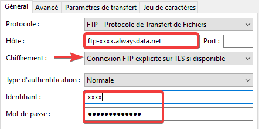
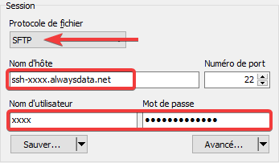
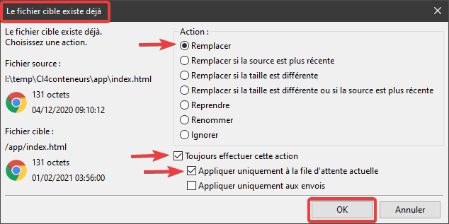
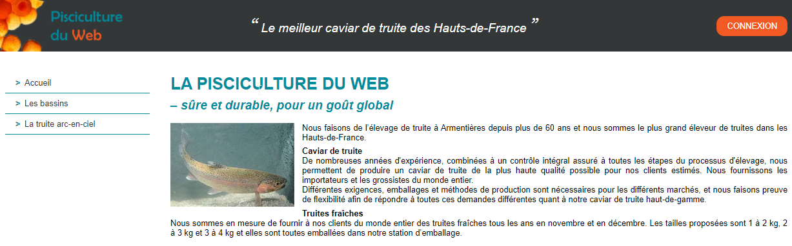
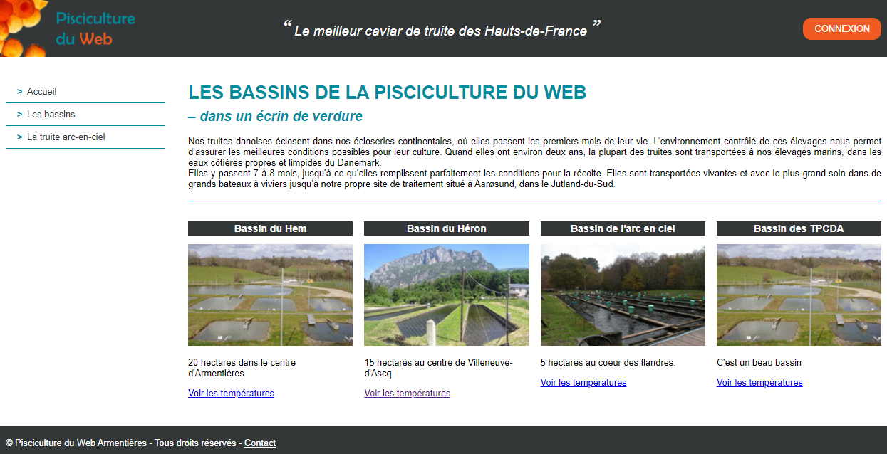

# Déploiement d'une application PHP/MySQL chez alwaysdata.com

> * Auteur : Gwénaël LAURENT
> * Date : 24/05/2021
> * OS : Windows 10 (version 20H2)

 [Licence Creative Commons](https://creativecommons.org/licenses/by-nc-sa/3.0/fr/)

- [Déploiement d'une application PHP/MySQL chez alwaysdata.com](#déploiement-dune-application-phpmysql-chez-alwaysdatacom)
- [1. Transférer les fichiers de votre application](#1-transférer-les-fichiers-de-votre-application)
  - [1.1 Connexion avec Filezilla](#11-connexion-avec-filezilla)
  - [1.2 Connexion avec WinSCP](#12-connexion-avec-winscp)
  - [1.3 Transférer les fichiers](#13-transférer-les-fichiers)
  - [1.4 Afficher les fichiers cachés](#14-afficher-les-fichiers-cachés)
  - [1.5 Paramétrer l'application déployée](#15-paramétrer-lapplication-déployée)
- [2. Déployer votre base de données](#2-déployer-votre-base-de-données)
  - [2.1 Exporter les données de la base locale](#21-exporter-les-données-de-la-base-locale)
  - [2.2 Importer les données dans la base distante](#22-importer-les-données-dans-la-base-distante)


# 1. Transférer les fichiers de votre application
> Vous pouvez vous transférer les fichiers en vous connectant soit en FTP (avec Filezilla) soit en SSH (avec WinSCP).

## 1.1 Connexion avec Filezilla
Il faut utiliser vos identifiants **```FTP```**



## 1.2 Connexion avec WinSCP
Il faut utiliser vos identifiants **```SSH```**



## 1.3 Transférer les fichiers
1. Supprimez tous les fichiers existants dans le dossier **```www```** distant
2. Transférez tout le contenu du dossier racine de votre site local dans le dossier **```www```** distant

Si le fichier distant existe déjà il faut le remplacer par celui que vous voulez transférer. Par exemple, avec FileZilla :



Dans un navigateur web, vous devez maintenant voir les pages **statiques** de votre site : http://xxxx.alwaysdata.net/



## 1.4 Afficher les fichiers cachés
> Les fichiers commençant par un point sont des fichiers "cachés" pour les système UNIX.

Pour afficher les fichiers cachés :
* dans **Filezilla** : Menu "Serveur" > "Forcer l'affichage des fichiers cachés"
* dans **WinSCP** : Menu "Options" > "Préférences" > "Panneaux" > "Afficher les fichiers cachés"

## 1.5 Paramétrer l'application déployée
Il faut maintenant modifier la configuration du site pour que PHP accède à la base de données distante. 
Il faut donc éditer le fichier **```bddconfig.php```** distant.

Vous pouvez éditer un fichier distant :
* dans **Filezilla** : Clic droit sur le fichier > "Afficher / Editer"
* dans **WinSCP** : Clic droit sur le fichier > "Editer"

Ce qu'il faut modifier dans le fichier **```bddconfig.php```** distant :
* $bddserver = mysql-[compte].alwaysdata.net
* $bddname = le nom de votre base de données [compte]_[yyyy]
* $bddlogin = utilisateur MySQL pour les accès PHP [compte]_[zzzz]
* $bddpass = le mot de passe choisi pour l'utilisateur MySQL


# 2. Déployer votre base de données
## 2.1 Exporter les données de la base locale
A l'aide de **```PhpMyAdmin```** de WampServer, exportez les données de votre base locale.

> Attention : il ne faut pas que le fichier d'exportation contienne d'instruction "CREATE DATABASE"

Dans PhpMyAdmin, sélectionnez la base de données (cliquez sur son nom dans la colonne de gauche) puis cliquez sur l'onglet **```Exporter```**.

Laisser la configuration proposée mais faites attention à ces points :
* Personnalisée ...
* Vérifiez que toutes les tables sont bien sélectionnées ainsi que leurs données
* Enregistrer la sortie vers un fichier
* **NE PAS COCHER** "Ajouter une instruction CREATE DATABASE / USE"
* Cliquez sur "Exécuter"

## 2.2 Importer les données dans la base distante
Dans un navigateur web, connectez vous au PhpMyAdmin distant : https://phpmyadmin.alwaysdata.com/. Connectez vous avec votre compte d'administrateur MySQL [compte].

Sélectionnez la base de données (cliquez sur son nom dans la colonne de gauche) puis cliquez sur l'onglet **```Import```** :
* cliquez sur le bouton "Choisir un fichier" :
* sélectionnez le fichier SQL précédemment exporté
* Décochez "Enable foreign key checks"
* Cliquer sur "Go"

Dans un navigateur web, vous devez maintenant voir les pages **dynamiques** de CodeIgniter : http://xxxx.alwaysdata.net/




