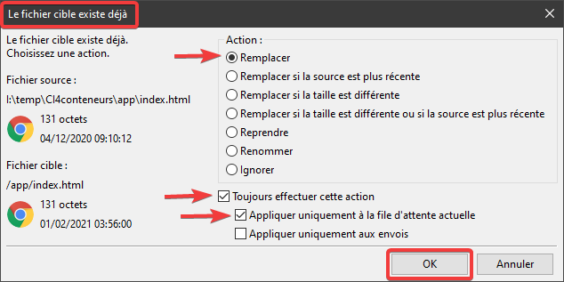

# Déploiement d'une application CodeIgniter 4 chez alwaysdata.com

> * Auteur : Gwénaël LAURENT
> * Date : 24/05/2021
> * OS : Windows 10 (version 20H2)

 [Licence Creative Commons](https://creativecommons.org/licenses/by-nc-sa/3.0/fr/)

- [Déploiement d'une application CodeIgniter 4 chez alwaysdata.com](#déploiement-dune-application-codeigniter-4-chez-alwaysdatacom)
- [1. Installer le framework avec composer](#1-installer-le-framework-avec-composer)
- [2. Modifier les droits UNIX des dossiers](#2-modifier-les-droits-unix-des-dossiers)
- [3. Modifier l'emplacement de la racine web](#3-modifier-lemplacement-de-la-racine-web)
- [4. Transférer les fichiers de votre application](#4-transférer-les-fichiers-de-votre-application)
  - [4.1 Connexion avec Filezilla](#41-connexion-avec-filezilla)
  - [4.2 Connexion avec WinSCP](#42-connexion-avec-winscp)
  - [4.3 Transférer les fichiers](#43-transférer-les-fichiers)
  - [4.4 Paramétrer l'application déployée](#44-paramétrer-lapplication-déployée)
- [5. Déployer votre base de données](#5-déployer-votre-base-de-données)
  - [5.1 Exporter les données de la base locale](#51-exporter-les-données-de-la-base-locale)
  - [5.2 Importer les données dans la base distante](#52-importer-les-données-dans-la-base-distante)


# 1. Installer le framework avec composer
> Documentation : [https://help.alwaysdata.com/fr/langages/php/installer-un-paquet/](https://help.alwaysdata.com/fr/langages/php/installer-un-paquet/)

Connectez vous en SSH sur le serveur alwaysdata et assurez vous d'être dans votre dossier racine du projet avec la commande ```pwd``` (print working directory) :
```console
xxxx@ssh1:~$ pwd
/home/xxxx
xxxx@ssh1:~$ ls
admin  www
```

> On ne peut pas installer CodeIgniter directement dans la racine du projet (/home/xxxx) car composer ne veut pas créer le projet dans un dossier non vide (ici, il y a déjà les dossiers admin et www, et il ne faut surtout pas les effacer !)

1. ```Installez CodeIgniter dans un dossier temporaire``` "ci4temp" :
    ```console
    xxxx@ssh1:~$ composer create-project codeigniter4/appstarter ci4temp
    ```

2. ```Déplacez tous les fichiers du framework sur la racine physique``` du projet :
    ```console
    xxxx@ssh1:~$ mv ci4temp/* .
    ```

3. ```Supprimez le dossier temporaire``` "ci4temp" :
    ```console
    xxxx@ssh1:~$ rm -rf ci4temp/
    ```

La racine physique doit maintenant contenir tous les fichiers de CodeIgniter + les dossiers "admin" et "www" :
```console
xxxx@ssh1:~$ ls -l
total 124
drwxr-xr-x  5 root   root      93 May  7 12:04 admin
drwxrwxr-x 12 xxxx xxxx   272 Feb  1 03:56 app
-rwxr-xr-x  1 xxxx xxxx  3760 Feb  1 03:56 builds
-rw-rw-r--  1 xxxx xxxx   897 May 11 23:13 composer.json
-rw-rw-r--  1 xxxx xxxx 88499 May 11 23:13 composer.lock
-rw-rw-r--  1 xxxx xxxx  4180 Feb  1 03:56 env
-rw-rw-r--  1 xxxx xxxx  1159 Feb  1 03:56 LICENSE
-rw-rw-r--  1 xxxx xxxx  2091 Feb  1 03:56 phpunit.xml.dist
drwxrwxr-x  2 xxxx xxxx    97 Feb  1 03:56 public
-rw-rw-r--  1 xxxx xxxx  2724 Feb  1 03:56 README.md
-rwxr-xr-x  1 xxxx xxxx  2236 Feb  1 03:56 spark
drwxrwxr-x  6 xxxx xxxx   106 Feb  1 03:56 tests
drwxrwxr-x 21 xxxx xxxx  4096 May 11 23:13 vendor
drwxrwxr-x  7 xxxx xxxx   122 Feb  1 03:56 writable
drwxr-xr-x  2 xxxx xxxx    32 May  7 12:04 www
```
Vous pouvez maintenant utiliser composer pour installer les traductions de CodeIgniter :
```console
xxxx@ssh1:~$ composer require codeigniter4/translations
```

Quand vous voudrez mettre à jour le framework, il suffira d'utiliser composer :
```console
xxxx@ssh1:~$ composer update
```

# 2. Modifier les droits UNIX des dossiers
Modifiez les droits d'accès des dossiers (755) dans ```app```, ```public```, ```tests``` et ```vendor``` et des fichiers qu'ils contiennent (644) :
```console
find app public tests vendor -type d -exec chmod 755 {} \;
find app public tests vendor -type f -exec chmod 644 {} \;
```

Ajoutez les droits d'écriture sur le dossier ```writable``` (770):
```console
chmod -R 770 writable
```

Modifiez les drois d'accès aux fichiers qui se trouvent à la racine :
```console
find . -maxdepth 1 -type f -exec chmod 644 {} \;
```
# 3. Modifier l'emplacement de la racine web
Il faut maintenant modifier l'emplacement de la racine web :

> La racine web est l'emplacement des fichiers accessibles depuis un navigateur web. Dans le cas de CodeIgniter c'est le dossier /public.

Dans l'interface d'administration : https://admin.alwaysdata.com/ :

```Menu : Web > Sites > Default site > Modifier```

Onglet CONFIGURATION :
* Répertoire racine : remplacez /www/ par **/public/**

Dans un navigateur web, vous devez maintenant voir la page d'accueil de CodeIgniter : http://xxxx.alwaysdata.net/


# 4. Transférer les fichiers de votre application
> Vous pouvez vous transférer les fichiers en vous connectant soit en FTP (avec Filezilla) soit en SSH (avec WinSCP).

## 4.1 Connexion avec Filezilla
Il faut utiliser vos identifiants **```FTP```**


## 4.2 Connexion avec WinSCP
Il faut utiliser vos identifiants **```SSH```**


## 4.3 Transférer les fichiers
> Dans une appli CodeIgniter 4, votre codage se situe dans 2 dossiers : **```app```** et **```public```** (le reste c'est le framework qui est déjà installé grâce à composer)

1. Transférer tout le contenu du dossier **```app```** local dans le dossier **```app```** distant
2. Transférer tout le contenu du dossier **```public```** local dans le dossier **```public```** distant

Si le fichier distant existe déjà il faut le remplacer par celui que vous voulez transférer. Par exemple, avec FileZilla :



Dans un navigateur web, vous devez maintenant voir les pages **statiques** de CodeIgniter : http://xxxx.alwaysdata.net/


## 4.4 Paramétrer l'application déployée
Votre application locale a été paramétrée grâce aux fichiers dans /app/Config (baseURL, database, routes ...). 

Pour le site déployé, vous pouvez modifier cette config en vous servant du fichier d'environnment **```.env```** situé sous la racine.

> Les variables actives dans le fichier .env (sans le # en début de ligne) supplantent la configuration effectuée dans les fichiers /app/Config. Donc pas besoin de modifier le contenu de /app/Config !

Commencer par modifier le nom du fichier distant ```env``` en ```.env```.

> Les fichiers commençant par un point sont des fichiers "cachés" pour les système UNIX.

Pour afficher les fichiers cachés :
* dans **Filezilla** : Menu "Serveur" > "Forcer l'affichage des fichiers cachés"
* dans **WinSCP** : Menu "Options" > "Préférences" > "Panneaux" > "Afficher les fichiers cachés"

Vous pouvez éditer un fichier distant :
* dans **Filezilla** : Clic droit sur le fichier > "Afficher / Editer"
* dans **WinSCP** : Clic droit sur le fichier > "Editer"

Ce qu'il faut modifier dans le fichier **```.env```** distant (le reste doit rester en commentaire):
* CI_ENVIRONMENT = production (ou en commentaire, mais pas development !)
* app.baseURL = 'http://[compte].alwaysdata.net/' C'est l'URL de votre site déployé avec un slash final
* database.default.hostname = mysql-[compte].alwaysdata.net
* database.default.database = le nom de votre base de données [compte]_[yyyy]
* database.default.username = utilisateur MySQL pour les accès PHP [compte]_[zzzz]
* database.default.password = le mot de passe choisi pour l'utilisateur MySQL
* database.default.DBDriver = MySQLi

# 5. Déployer votre base de données
## 5.1 Exporter les données de la base locale
A l'aide de **```PhpMyAdmin```** de WampServer, exportez les données de votre base locale.

> Attention : il ne faut pas que le fichier d'exportation contienne d'instruction "CREATE DATABASE"

Dans PhpMyAdmin, sélectionnez la base de données (cliquez sur son nom dans la colonne de gauche) puis cliquez sur l'onglet **```Exporter```**.

Laisser la configuration proposée mais faites attention à ces points :
* Personnalisée ...
* Vérifiez que toutes les tables sont bien sélectionnées ainsi que leurs données
* Enregistrer la sortie vers un fichier
* **NE PAS COCHER** "Ajouter une instruction CREATE DATABASE / USE"
* Cliquez sur "Exécuter"

## 5.2 Importer les données dans la base distante
Dans un navigateur web, connectez vous au PhpMyAdmin distant : https://phpmyadmin.alwaysdata.com/. Connectez vous avec votre compte d'administrateur MySQL [compte].

Sélectionnez la base de données (cliquez sur son nom dans la colonne de gauche) puis cliquez sur l'onglet **```Import```** :
* cliquez sur le bouton "Choisir un fichier" :
* sélectionnez le fichier SQL précédemment exporté
* Décochez "Enable foreign key checks"
* Cliquer sur "Go"

Dans un navigateur web, vous devez maintenant voir les pages **dynamiques** de CodeIgniter : http://xxxx.alwaysdata.net/


